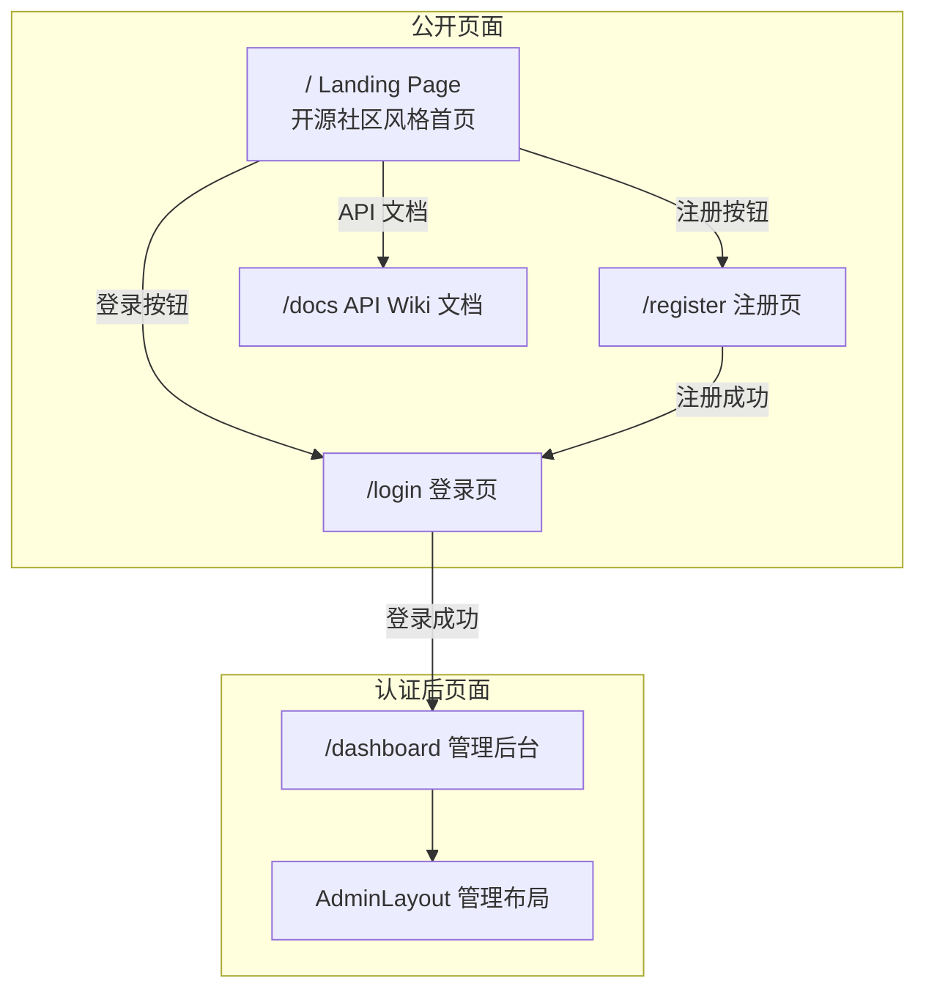
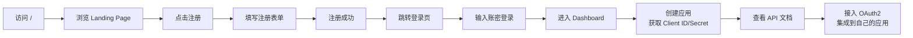

## 整体架构



## 一、路由改造

**文件**: [jbm-admin-vue/src/router/index.ts](jbm-admin-vue/src/router/index.ts)

- `/` 根路径从重定向到 `/dashboard` 改为指向新的 `LandingPage.vue`（公开页面）
- 新增 `/register` -> `RegisterPage.vue`（公开页面）
- 新增 `/docs` -> `ApiWikiPage.vue`（公开页面）
- `/dashboard` 及其他管理页面路径不变，仍需认证
- 路由守卫调整：已登录用户访问 `/` 不自动跳转 dashboard（允许查看首页）

## 二、Landing Page 设计（开源社区风格）

**新建文件**: `jbm-admin-vue/src/views/landing/LandingPage.vue`

采用蓝色科技感品牌色（保持现有 primary `hsl(221.2 83.2% 53.3%)`），结构如下：

```
┌─────────────────────────────────────────────┐
│ 导航栏：Logo + 首页 | API文档 | 登录 | 注册  │
├─────────────────────────────────────────────┤
│ Hero 区域                                    │
│   JBM - 开源统一认证授权平台                   │
│   基于 OAuth2 的微服务权限管理中间件            │
│   [快速开始] [API 文档] [GitHub]              │
├─────────────────────────────────────────────┤
│ 核心能力（4 列卡片）                          │
│   OAuth2认证 | RBAC权限 | 微服务网关 | 多租户  │
├─────────────────────────────────────────────┤
│ 技术栈展示                                    │
│   Spring Boot + Vue3 + Sa-Token + Redis      │
├─────────────────────────────────────────────┤
│ 快速开始（3 步接入流程）                       │
│   1.注册应用  2.获取密钥  3.接入认证            │
├─────────────────────────────────────────────┤
│ Footer：版权 + 链接                           │
└─────────────────────────────────────────────┘
```

## 三、登录页重新设计

**文件**: [jbm-admin-vue/src/views/login/LoginPage.vue](jbm-admin-vue/src/views/login/LoginPage.vue)

当前 851 行，功能复杂（8 种登录方式 + 高级 OAuth 配置），需要：

1. **视觉重新设计**：从居中白色卡片改为分栏布局
   - 左侧：品牌区域（Logo、标语、开源社区信息）
   - 右侧：登录表单（简化默认显示，高级选项折叠）
2. **登录方式精简**：默认只显示「密码登录」，其他方式（短信/扫码/授权码等）通过「更多登录方式」折叠展开
3. **添加注册入口**：登录表单下方增加「没有账号？立即注册」链接
4. **OAuth2 客户端高级配置**：保持折叠，但默认收起（生产环境更友好）
5. **添加「返回首页」链接**

## 四、注册页面

**新建文件**: `jbm-admin-vue/src/views/register/RegisterPage.vue`

注册表单包含：
- 用户名（必填）
- 密码 + 确认密码（必填）
- 手机号（可选）
- 邮箱（可选）
- 图形验证码
- 注册按钮 -> 调用 `POST /oauth2/register`

**新建 API**: `jbm-admin-vue/src/api/auth.ts` 新增 `register()` 函数

后端已有 `POST /oauth2/register` 端点（在 `OAuth2ServerController.java` 中），前端对接即可。

## 五、API Wiki 文档页面

**新建文件**: `jbm-admin-vue/src/views/docs/ApiWikiPage.vue`

按用户接入流程组织文档，分为以下章节：

### 5.1 文档导航结构
```
├── 快速开始
│   ├── 1. 注册 JBM 账号
│   ├── 2. 创建应用（获取 Client ID / Secret）
│   └── 3. 选择接入方式
├── OAuth2 接入指南
│   ├── 授权码模式（推荐）
│   ├── 密码模式
│   ├── 客户端凭证模式
│   └── 刷新 Token
├── API 参考
│   ├── 认证接口（/oauth2/*）
│   ├── 用户接口（/user/*）
│   ├── 权限接口（/authority/*）
│   └── 开发者接口（/developer/*）
├── SDK 与示例
│   ├── 前端接入示例（Vue/React）
│   └── 后端接入示例（Spring Boot）
└── 常见问题（FAQ）
```

### 5.2 页面布局
- 左侧固定目录导航
- 右侧内容区域（Markdown 渲染 + 代码示例高亮）
- 顶部搜索框
- 每个 API 端点展示：请求方法、URL、参数、请求示例、响应示例

### 5.3 数据来源
文档内容直接编写在 Vue 组件中（静态内容 + 代码片段），使用语法高亮显示。

## 六、从用户角度走通接入流程

完整的用户旅程：



## 七、实现任务清单

### Phase 1: 路由与基础结构
1. 修改路由配置 - `/` 指向 Landing Page，新增 `/register` 和 `/docs`
2. 创建 LandingPage.vue 基础结构

### Phase 2: Landing Page
3. 实现导航栏组件（Logo、菜单项、登录/注册按钮）
4. 实现 Hero 区域
5. 实现核心能力展示区
6. 实现技术栈与快速开始区域
7. 实现 Footer

### Phase 3: 登录页重设计
8. 重新设计 LoginPage.vue 布局（左右分栏）
9. 精简默认登录方式显示
10. 添加注册入口链接

### Phase 4: 注册页面
11. 创建 RegisterPage.vue
12. 新增 `register()` API 函数

### Phase 5: API Wiki 文档
13. 创建 ApiWikiPage.vue 文档页面框架
14. 编写快速开始文档
15. 编写 OAuth2 接入指南
16. 编写 API 参考文档
17. 编写 SDK 示例代码

### Phase 6: 联调与优化
18. 调整路由守卫逻辑
19. 整体风格统一与响应式适配
20. 移动端适配

## 涉及的关键文件

| 操作 | 文件 |
|------|------|
| 修改 | `jbm-admin-vue/src/router/index.ts` |
| 重写 | `jbm-admin-vue/src/views/login/LoginPage.vue` |
| 新建 | `jbm-admin-vue/src/views/landing/LandingPage.vue` |
| 新建 | `jbm-admin-vue/src/views/register/RegisterPage.vue` |
| 新建 | `jbm-admin-vue/src/views/docs/ApiWikiPage.vue` |
| 新建 | `jbm-admin-vue/src/components/landing/` (导航栏等子组件) |
| 修改 | `jbm-admin-vue/src/api/auth.ts` (新增 register 函数) |
