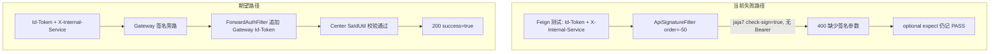

# 服务间互信测试修复计划

## 问题诊断

当前 [`docs/testing/feign-trust-jaja7/summary-test-report.md`](docs/testing/feign-trust-jaja7/summary-test-report.md) 显示 **ALL PASS**，但核心互信用例实际未通过，属于**测试假阳性**：

| 用例 | 期望 | 实际 HTTP | 实际现象 | 报告结果 |
|------|------|-----------|----------|----------|
| TC-TRUST-01 | Id-Token 访问 `/gateway/api/route` | **400** | `缺少签名参数` | PASS（假） |
| TC-TRUST-06 | 有效 Id-Token 内部调用 | **400** | `缺少签名参数` | PASS（假） |

另：[`docs/testing/api-key-flow-jaja7/report.md`](docs/testing/api-key-flow-jaja7/report.md) 中 **TC10** 返回 Center 401「服务认证失败」。



### 根因 1：Gateway 签名与 Id-Token 未对齐

[`ApiSignatureFilter.java`](jbm-cluster/jbm-cluster-platform/jbm-cluster-platform-gateway/src/main/java/com/jbm/cluster/platform/gateway/filter/ApiSignatureFilter.java) 在 jaja7（[`bootstrap-jaja7.yml`](jbm-cluster/jbm-cluster-platform/jbm-cluster-platform-gateway/src/main/resources/bootstrap-jaja7.yml) `check-sign: true`）下，缺少 RSA 签名时**仅放行 Bearer**，未识别 `Satoken-Id-Token` + `X-Internal-Service`：

```50:56:jbm-cluster/jbm-cluster-platform/jbm-cluster-platform-gateway/src/main/java/com/jbm/cluster/platform/gateway/filter/ApiSignatureFilter.java
        if (StrUtil.hasBlank(appId, timestamp, signature)) {
            String authorization = request.getHeaders().getFirst(HttpHeaders.AUTHORIZATION);
            if (StrUtil.isNotBlank(authorization) && StrUtil.startWithIgnoreCase(authorization.trim(), "Bearer ")) {
                return chain.filter(exchange);
            }
            return Mono.error(new OpenSignatureException("缺少签名参数"));
        }
```

请求在 Gateway 层即被拦截，**从未到达 Center**，`SaOAuthFilterAuthStrategy` 的 Id-Token 逻辑未被验证。

### 根因 2：Center 认证与架构文档不一致

[`auth-access-system.md`](docs/architecture/auth-access-system.md) 要求无 Bearer 时执行 `SaIdUtil.checkCurrentRequestToken()`，但 [`JbmSecurityConfiguration.java`](jbm-cluster/jbm-cluster-common/jbm-cluster-common-security/src/main/java/com/jbm/cluster/common/security/configuration/JbmSecurityConfiguration.java) 在仅有 `X-Internal-Service` 时**直接跳过全部认证**（不校验 Id-Token）；[`SaOAuthFilterAuthStrategy.java`](jbm-cluster/jbm-cluster-common/jbm-cluster-common-satoken/src/main/java/com/jbm/cluster/common/satoken/core/filter/SaOAuthFilterAuthStrategy.java) 还存在 Id-Token 失败后仅凭 `X-Internal-Service` 放行的 fallback（可被伪造 Header 利用）。

### 根因 3：测试框架假阳性

[`run_feign_trust_rest_tests.py`](scripts/run_feign_trust_rest_tests.py) 中 `expect: optional` **默认 ok=True**，仅当 `success=true` 时才跑断言；TC-TRUST-01/06 配置为 optional，HTTP 400 仍记 PASS。

### 根因 4：API Key TC10 — Gateway 已授权但 Center 无有效认证上下文

TC10 通过 [`signed_get()`](scripts/run_api_key_flow_tests.py) 仅携带 `X-App-Id/X-Timestamp/X-Signature`（无 Bearer），Gateway 侧 [`DeveloperAuthFilter`](jbm-cluster/jbm-cluster-platform/jbm-cluster-platform-gateway/src/main/java/com/jbm/cluster/platform/gateway/filter/DeveloperAuthFilter.java) 校验通过后转发 Center，但 Center 返回 401（[`SaSuperFilterErrorStrategy`](jbm-cluster/jbm-cluster-common/jbm-cluster-common-satoken/src/main/java/com/jbm/cluster/common/satoken/core/filter/SaSuperFilterErrorStrategy.java)）。

修复方向：Gateway 在 API Key 授权通过后向下游注入可识别的网关认证上下文（`gateway.apiKeyId` → Header），Center 识别「Gateway 已验签 + 已授权 API Key」的请求并放行，无需用户 Bearer。

---

## 修复方案

### 1. Gateway：ApiSignatureFilter 增加 Id-Token 内部旁路

**文件**：[`ApiSignatureFilter.java`](jbm-cluster/jbm-cluster-platform/jbm-cluster-platform-gateway/src/main/java/com/jbm/cluster/platform/gateway/filter/ApiSignatureFilter.java)

在 Bearer 旁路之后、返回 400 之前，增加与架构一致的内部互信旁路（与 Bearer 同级，不在 Gateway 做 Redis 校验，由 Center 负责）：

```java
String idToken = header(request, SaIdUtil.ID_TOKEN);
String internalService = header(request, JbmSecurityConstants.INTERNAL_SERVICE);
if (StrUtil.isNotBlank(idToken) && StrUtil.isNotBlank(internalService)) {
    return chain.filter(exchange);
}
```

需补充 import：`SaIdUtil`、`JbmSecurityConstants`。

### 2. Gateway：ForwardAuthFilter 传播 API Key 身份

**文件**：[`ForwardAuthFilter.java`](jbm-cluster/jbm-cluster-platform/jbm-cluster-platform-gateway/src/main/java/com/jbm/cluster/platform/gateway/filter/ForwardAuthFilter.java)

- 从 `exchange.getAttribute("gateway.apiKeyId")` 读取 [`DeveloperAuthFilter`](jbm-cluster/jbm-cluster-platform/jbm-cluster-platform-gateway/src/main/java/com/jbm/cluster/platform/gateway/filter/DeveloperAuthFilter.java) 写入的值
- 转发时追加 Header（建议在 [`JbmSecurityConstants.java`](jbm-cluster/jbm-cluster-core/src/main/java/com/jbm/cluster/core/constant/JbmSecurityConstants.java) 新增常量，如 `GATEWAY_API_KEY_ID = "X-Gateway-Api-Key-Id"`）
- 实现 `Ordered`，order 保持在签名/授权过滤器之后、路由之前（如 `Ordered.HIGHEST_PRECEDENCE + 10`）

### 3. Center：对齐 Id-Token 校验，移除不安全 fallback

**文件**：[`JbmSecurityConfiguration.java`](jbm-cluster/jbm-cluster-common/jbm-cluster-common-security/src/main/java/com/jbm/cluster/common/security/configuration/JbmSecurityConfiguration.java)

- **删除**「无 Authorization + 有 X-Internal-Service → 直接 return」的盲跳过
- 统一走 `SaOAuthFilterAuthStrategy`（或在其前增加 API Key 网关上下文分支）

**文件**：[`SaOAuthFilterAuthStrategy.java`](jbm-cluster/jbm-cluster-common/jbm-cluster-common-satoken/src/main/java/com/jbm/cluster/common/satoken/core/filter/SaOAuthFilterAuthStrategy.java)

- 无 Bearer 时：先识别 `X-Gateway-Api-Key-Id` + `X-Internal-Service`（Gateway 已验 API Key）→ 记录内部调用方并放行
- 否则执行 `SaIdUtil.checkCurrentRequestToken()` 校验 Id-Token
- **删除** `isInternalCaller()` fallback（禁止仅凭伪造 `X-Internal-Service` 放行）

### 4. Id-Token 签发一致性

**文件**：

- [`InternalTrustTokenController.java`](jbm-cluster/jbm-cluster-platform/jbm-cluster-platform-auth/src/main/java/com/jbm/cluster/auth/controller/InternalTrustTokenController.java)（Auth）
- [`InternalTrustTokenController.java`](jbm-cluster/jbm-cluster-platform/jbm-cluster-platform-center/src/main/java/com/jbm/cluster/center/controller/InternalTrustTokenController.java)（Center）

与 [`AppPreRequestInterceptor`](jbm-cluster/jbm-cluster-common/jbm-cluster-common-fegin/src/main/java/com/jbm/cluster/common/feign/AppPreRequestInterceptor.java) / `ForwardAuthFilter` 一致，使用 `SaIdUtil.getToken()` 为空时 `SaIdUtil.refreshToken()` 兜底。

### 5. 测试修复：消除假阳性 + TC10 对齐

**文件**：[`feign_trust_rest_modules.json`](scripts/feign_trust_rest_modules.json)

- TC-TRUST-01、TC-TRUST-06：`"expect": "optional"` → `"expect": "success"`

**文件**：[`run_feign_trust_rest_tests.py`](scripts/run_feign_trust_rest_tests.py)

- 收紧 `optional`：当配置了 `assert` 且 `success != true` 时记 **FAIL**（或至少 WARN + FAIL），避免再次掩盖

**文件**：[`run_api_key_flow_tests.py`](scripts/run_api_key_flow_tests.py)

- TC10 在 Gateway/Center 修复后应无需 Bearer；若目标 API 带 `@SaCheckLogin`，则 `signed_get(target, api_key, priv, token=ctx["thirdAccessToken"])` 作为补充（TC9 已签发 client_token）

---

## 验证步骤

服务需以 `jaja7` profile 运行（Gateway 7777 / Center 8888 / Auth 5555）：

```powershell
cd D:\workspaces\JBM7
$env:LOGIN_PASSWORD='Admin@123'
python scripts\run_feign_trust_rest_tests.py --profile jaja7 --wait 60 --base-url http://127.0.0.1:7777
python scripts\run_api_key_flow_tests.py
python scripts\run_all_rest_tests.py --profile jaja7 --wait 60 --base-url http://127.0.0.1:7777 --auth-url http://127.0.0.1:5555
```

**通过标准**：

- TC-TRUST-01/06：`GET /gateway/api/route` → **HTTP 200** + `success=true`（不再是 400）
- TC-TRUST-02~04：仍应拒绝（无 token / 坏 token / 假 Id-Token）
- TC-TRUST-05：用户 Bearer 路径仍 200
- API Key TC10：签名调用已授权 API → **HTTP 200**
- 更新后的测试报告不再出现「PASS + 缺少签名参数」组合

---

## 影响范围与风险

- **正向**：Feign/内部调用、Gateway 转发、API Key 第三方签名调用链路打通
- **安全收紧**：移除 Center 仅凭 `X-Internal-Service` 的盲放行；外部请求必须满足签名/Bearer/有效 Id-Token 之一
- **需重启**：Gateway、Center、Auth 均需重新编译部署后验证
