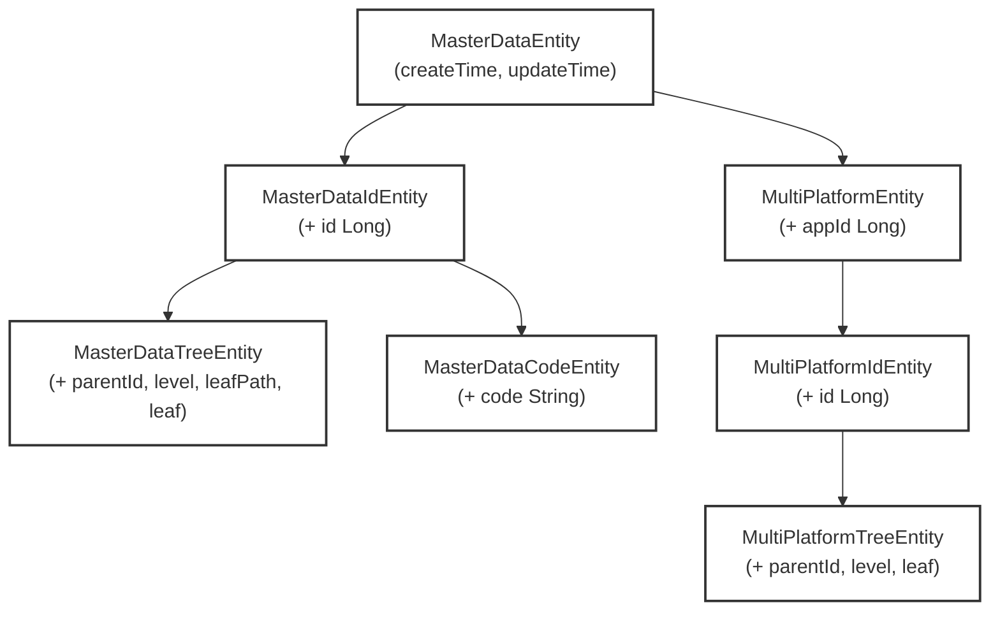
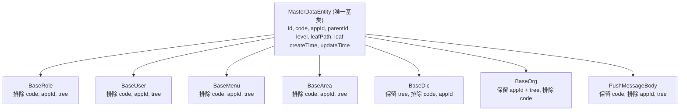

# 简化 ORM 基类继承结构

## 当前继承结构分析



### 各基类使用情况统计

| 基类 | 核心字段 | 业务实体使用数 | 分析 |
|------|----------|----------------|------|
| `MasterDataEntity` | createTime, updateTime | 约 32 个 | **保留为唯一基类** |
| `MasterDataIdEntity` | + id (Long) | 约 30 个 | **合并到 MasterDataEntity** |
| `MasterDataTreeEntity` | + parentId, level, leafPath, leaf | 约 27 个 | **合并到 MasterDataEntity** |
| `MasterDataCodeEntity` | + code (String) | 1 个 | **合并到 MasterDataEntity** |
| `MultiPlatformEntity` | + appId (Long) | 4 个 | **合并到 MasterDataEntity** |
| `MultiPlatformTreeEntity` | + parentId, level, leaf | 1 个 | **合并到 MasterDataEntity** |
| `bean.BaseEntity` | id | 0 个 | **删除** |
| `bean.AdvEntity` | id + code | 0 个 | **删除** |
| `bean.MasterDataTreeEntity` | parentCode 版本 | 0 个 | **删除** |

### 核心思路

**基类放宽 + 子类收紧**：
- 基类包含所有通用字段（id, code, appId, parentId, level, leafPath, leaf, createTime, updateTime），Service 层可统一管理这些字段的逻辑
- 实体不需要的字段通过 `@TableField(exist = false)` 在子类上标注排除，避免自动建表时多出列
- id、code、appId 本身有很多统一处理逻辑，放在基类便于集中管理
- 子类可以覆盖基类的 id（如使用 userId/menuId 等自定义名称）

## 简化方案

### 新继承结构设计（单一基类）



### 最终基类结构

```java
@Data
@TableName
public abstract class MasterDataEntity implements Serializable {
    // 主键 ID - 所有表都需要，子类可覆盖
    @TableId(type = IdType.ASSIGN_ID)
    @ApiModelProperty("主键ID")
    private Long id;
    
    // 业务编码 - 按需使用
    @ApiModelProperty("业务编码")
    private String code;
    
    // 应用ID - 多平台/租户隔离
    @ApiModelProperty("应用ID")
    private Long appId;
    
    // 树形结构字段 - 按需使用
    @ApiModelProperty("树状结构父ID")
    private Long parentId;
    
    @ApiModelProperty("树状结构层级")
    private Integer level;
    
    @ApiModelProperty("树状结构的路径")
    private String leafPath;
    
    @TableField(exist = false)
    @ApiModelProperty("树状结构是否叶子节点")
    private Boolean leaf;
    
    // 审计时间字段 - 所有表都需要
    @TableField(fill = FieldFill.INSERT)
    @ApiModelProperty("创建时间")
    private Date createTime;
    
    @TableField(fill = FieldFill.INSERT_UPDATE)
    @ApiModelProperty("更新时间")
    private Date updateTime;
}
```

### 子类收紧示例

**普通实体（排除多余字段）**：
```java
// BaseRole 不需要 code, appId, tree
@Data
public class BaseRole extends MasterDataEntity {
    @TableId(type = IdType.ASSIGN_ID)
    private Long roleId;  // 覆盖基类 id
    
    @TableField(exist = false)
    private String code;      // 排除基类的 code
    
    @TableField(exist = false)
    private Long appId;       // 排除基类的 appId
    
    @TableField(exist = false)
    private Long parentId;    // 排除基类的 parentId
    
    @TableField(exist = false)
    private Integer level;    // 排除基类的 level
    
    @TableField(exist = false)
    private String leafPath;  // 排除基类的 leafPath
    
    private String roleCode;  // 自有业务字段
    // ...
}
```

**树形实体（保留 tree 字段）**：
```java
// BaseDic 保留 tree 字段，排除 code, appId
@Data
public class BaseDic extends MasterDataEntity {
    @TableId(type = IdType.ASSIGN_ID)
    private Long dicId;  // 覆盖基类 id
    
    @TableField(exist = false)
    private String code;   // 排除
    @TableField(exist = false)
    private Long appId;    // 排除
    
    // parentId, level, leafPath 从基类继承，保留映射
    
    private String dicName;
    // ...
}
```

**多平台树形实体（保留所有字段）**：
```java
// BaseOrg 保留 appId + tree，排除 code
@Data
public class BaseOrg extends MasterDataEntity {
    @TableId(type = IdType.ASSIGN_ID)
    private Long orgId;
    
    @TableField(exist = false)
    private String code;  // 排除 code
    
    // appId, parentId, level, leafPath 保留
    
    private String orgName;
    // ...
}
```

### 删除的基类

| 要删除的文件 | 原因 |
|-------------|------|
| `entity/MasterDataIdEntity.java` | 合并到 MasterDataEntity |
| `entity/MasterDataTreeEntity.java` | 合并到 MasterDataEntity |
| `entity/MasterDataCodeEntity.java` | 合并到 MasterDataEntity |
| `entity/MultiPlatformEntity.java` | 合并到 MasterDataEntity |
| `entity/MultiPlatformIdEntity.java` | 合并到 MasterDataEntity |
| `entity/MultiPlatformTreeEntity.java` | 合并到 MasterDataEntity |
| `bean/BaseEntity.java` | 无业务实体使用 |
| `bean/AdvEntity.java` | 无业务实体使用 |
| `bean/MasterDataTreeEntity.java` | 旧版，无使用 |
| `bean/PrimaryKey.java` | 无使用 |
| `bean/CodePrimaryKey.java` | 无使用 |

### Service 层统一

所有 Service 基类泛型约束统一为 `Entity extends MasterDataEntity`：

| 当前 | 新方案 |
|------|--------|
| `IMasterDataService<Entity extends MasterDataEntity>` | 不变 |
| `IMasterDataTreeService<Entity extends MasterDataTreeEntity>` | `IMasterDataTreeService<Entity extends MasterDataEntity>` |
| `IMasterDataCodeService<Entity extends MasterDataCodeEntity>` | 删除，合并到 IMasterDataService |
| `IMultiPlatformService<Entity extends MultiPlatformEntity>` | 删除，合并到 IMasterDataService |
| `IMultiPlatformTreeService<Entity extends MultiPlatformTreeEntity>` | 删除，合并到 IMasterDataService |
| `MasterDataServiceImpl` | 不变 |
| `MasterDataTreeServiceImpl` | 泛型改为 `<Entity extends MasterDataEntity>` |
| `MasterDataCodeServiceImpl` | 删除 |
| `MultiPlatformServiceImpl` | 删除 |
| `MultiPlatformTreeServiceImpl` | 删除 |
| `TreeBusiness<E extends MasterDataTreeEntity>` | `TreeBusiness<E extends MasterDataEntity>` |

## 实施步骤

### 步骤 1: 合并 MasterDataEntity 添加所有字段

修改 `MasterDataEntity.java`，添加 id, code, appId, parentId, level, leafPath, leaf：

```java
// 文件: jbm-framework/jbm-framework-data/jbm-framework-data-masterdata/src/main/java/com/jbm/framework/masterdata/usage/entity/MasterDataEntity.java
```

### 步骤 2: 删除冗余基类

删除 `entity/` 包下的 6 个文件：
- `MasterDataIdEntity.java`
- `MasterDataTreeEntity.java`
- `MasterDataCodeEntity.java`
- `MultiPlatformEntity.java`
- `MultiPlatformIdEntity.java`
- `MultiPlatformTreeEntity.java`

删除 `bean/` 包下的 5 个文件：
- `bean/BaseEntity.java`
- `bean/AdvEntity.java`
- `bean/MasterDataTreeEntity.java`
- `bean/PrimaryKey.java`
- `bean/CodePrimaryKey.java`

### 步骤 3: 更新业务实体继承

将所有业务实体的继承改为 `extends MasterDataEntity`，不需要的字段标注 `@TableField(exist = false)`：

**排除字段规则**：

| 实体类型 | 排除字段 | 保留字段 | 示例 |
|----------|----------|----------|------|
| 普通实体 | code, appId, parentId, level, leafPath | id, createTime, updateTime | BaseRole, BaseUser, BaseMenu |
| 树形实体 | code, appId | id, tree, createTime, updateTime | BaseDic, BaseArea |
| 多平台实体 | code, tree | id, appId, createTime, updateTime | WebhookTask |
| 多平台树形 | code | id, appId, tree, createTime, updateTime | BaseOrg |
| 编码实体 | appId, tree | id, code, createTime, updateTime | PushMessageBody |

### 步骤 4: 更新 Service 层

- 删除 `IMasterDataCodeService`、`IMultiPlatformService`、`IMultiPlatformTreeService` 及对应实现类
- 更新 `IMasterDataTreeService` 泛型为 `<Entity extends MasterDataEntity>`
- 更新 `MasterDataTreeServiceImpl` 泛型为 `<Entity extends MasterDataEntity>`
- 更新 `TreeBusiness` 泛型为 `<E extends MasterDataEntity>`

### 步骤 5: 更新 Controller/Collection 层

- 删除 `IMultiPlatformController`、`IMultiPlatformTreeController`
- 删除 `MultiPlatformCollection`、`MultiPlatformTreeCollection`
- `MasterDataTreeCollection` 泛型改为 `<Entity extends MasterDataEntity>`

### 步骤 6: 清理 bean 包

删除 `com.jbm.framework.masterdata.usage.bean` 包中不再使用的类，保留仍在内部使用的 `EntityMap` 和 `EnumConvertInterceptor`。

### 步骤 7: 编译验证

运行 Maven 编译确保所有更改无错误：
```bash
mvn clean compile -DskipTests
```

## 注意事项

1. **基类统一管理**：id、code、appId、tree 等字段的处理逻辑集中在基类，Service 层可统一处理
2. **子类收紧排除**：通过 `@TableField(exist = false)` 标注不需要的字段，避免建表时产生多余列
3. **id 可覆盖**：实体可重新声明 `roleId`、`menuId` 等自有主键覆盖基类的 `id`
4. **Service 精简**：删除 MultiPlatform* 和 Code 相关的 Service 接口及实现类
5. **测试覆盖**：编译后运行单元测试验证功能正常

## 影响范围

- **修改文件**：约 70+ 个 Java 文件
- **删除文件**：约 16 个（基类 + Service + Controller 冗余文件）
- **风险**：低（仅基类变更，业务逻辑字段不变）
