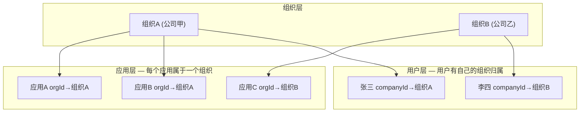
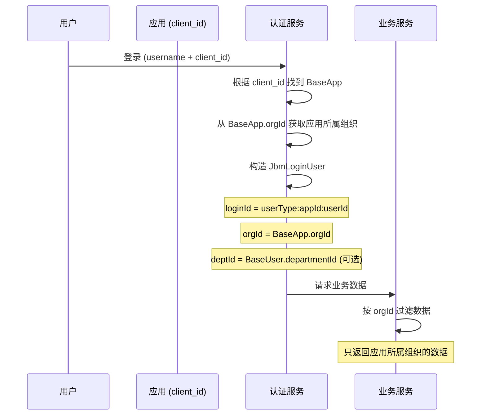

# 组织结构、应用与多租户 — 设计与实施方案

## 一、设计模型

### 1.1 双层隔离模型

```
用户有自己所属的组织（主组织）
     +
登录时根据应用切换组织上下文
     =
最终数据可见性 = 登录应用所属组织的数据范围
```

### 1.2 核心关系



### 1.3 登录上下文切换



### 1.4 数据可见性规则

| 场景 | 结果 |
|------|------|
| 组织A的用户通过属于组织A的应用登录 | 看到组织A的数据 |
| 组织A的用户通过属于组织B的应用登录 | 看到自己组织（组织A）的数据 |
| 超管通过任何应用登录 | 看到全部数据 |

**核心原则**：用户登录后看到的是**自己所属组织**的数据，而不是应用所属组织的数据。

### 1.5 设计决策汇总

| 决策项 | 选择 | 说明 |
|--------|------|------|
| 用户-部门关系 | 单部门（可选） | departmentId 保留但可选，主要用于内部管理 |
| 跨组织登录 | 允许，但看自己组织 | 组织A用户通过组织B的应用登录，看到组织A的数据 |
| 应用-组织关联 | BaseApp 新增 orgId | 每个应用属于一个组织 |
| 数据范围粒度 | 本部门及下级 | 根据组织层级自动判断 |
| 组织类型 | 不区分 company/department | 统一为组织节点 |
| 跨部门数据访问 | 用户-组织授权表 | 管理员可授权用户访问指定组织的数据 |
| 注册组织归属 | 自动分配默认组织 | 新用户注册时自动分配 |
| 组织权限授权 | 用户-组织授权表 | 类似角色授权 |

---

## 二、现状分析

### 2.1 后端已就绪的功能

| 功能 | 代码 | 状态 |
|------|------|------|
| 组织实体 | `BaseOrg.java` | 实体完整，**表缺失** |
| 组织服务 | `BaseOrgServiceImpl.java` | 代码完整，依赖表 |
| 组织控制器 | `BaseOrgController.java` | 端点已实现 |
| 用户-组织关联 | `BaseUser.companyId/departmentId` | 字段已存在 |
| 数据过滤 | `BaseUserBusinessImpl.selectEntitys()` | 按 companyId 过滤 |
| 登录组织信息 | `JbmLoginUser.deptId/companyId` | 已携带 |

### 2.2 需要新增/修改的功能

| 功能 | 修改内容 |
|------|---------|
| `base_org` 表 | 新建迁移脚本 |
| `BaseApp.orgId` | 新增字段关联组织 |
| 登录流程 | 从 BaseApp.orgId 获取组织上下文 |
| 数据过滤 | 按 orgId 而非 companyId 过滤 |
| 用户-组织授权表 | 新建 `base_user_org` 表 |
| 前端用户管理 | 增加组织选择 |
| 前端应用管理 | 增加组织选择 |
| 注册流程 | 自动分配默认组织 |

### 2.3 前端现状

| 页面 | 组织关联 | 状态 |
|------|---------|------|
| 组织管理 `OrgList.vue` | 独立 CRUD | 已实现，依赖表 |
| 用户管理 `UserList.vue` | 无组织字段 | 缺失 |
| 应用管理 `AppList.vue` | 无组织字段 | 缺失 |
| `BaseUser` TS 类型 | 无 companyId/departmentId | 缺失 |
| `BaseOrg` TS 类型 | 字段不完整 | 缺失 |

---

## 三、实施方案

### 阶段一：基础设施（让组织管理可用）

#### 步骤 1.1：创建 base_org 表

文件：`jbm-cluster-common-mysql/src/main/resources/db/cluster-rbac/changes/V12__org_table.sql`

```sql
CREATE TABLE IF NOT EXISTS base_org (
    id                BIGINT       NOT NULL PRIMARY KEY,
    code              VARCHAR(64),
    app_id            BIGINT,
    parent_id         BIGINT,
    level             INT,
    leaf_path         VARCHAR(512),
    org_name          VARCHAR(128) NOT NULL,
    org_code          VARCHAR(64),
    manager_id        BIGINT,
    leader_id         BIGINT,
    group_id          VARCHAR(64),
    source_id         VARCHAR(64),
    number_of_accounts INT,
    org_address       TEXT,
    status            INT          DEFAULT 1,
    create_time       TIMESTAMP,
    update_time       TIMESTAMP
);

CREATE INDEX idx_org_parent ON base_org(parent_id);
CREATE INDEX idx_org_group ON base_org(group_id);
```

> 注意：去掉了 `org_type` 字段（根据设计决策，不区分 company/department）

#### 步骤 1.2：种子数据

```sql
INSERT INTO base_org (id, org_name, parent_id, group_id, level, leaf_path, status, create_time)
VALUES (1, '默认组织', NULL, '1', 1, '1', 1, NOW());
```

#### 步骤 1.3：更新 Liquibase changelog

### 阶段二：应用-组织关联

#### 步骤 2.1：BaseApp 增加 orgId

- 修改 `BaseApp.java` 增加 `orgId` 字段
- 修改 `base_app` 表增加 `org_id` 列
- 前端应用管理增加组织选择

#### 步骤 2.2：登录流程修改

- 登录时从 `BaseApp.orgId` 获取应用所属组织
- 将 `orgId` 写入 `JbmLoginUser`
- `LoginHelper` 增加获取当前组织的方法

### 阶段三：数据过滤重构

#### 步骤 3.1：统一数据过滤

- 将 `companyId` 过滤改为 `orgId` 过滤
- 支持本部门及下级的数据范围
- `BaseUserBusinessImpl.selectEntitys()` 重构

#### 步骤 3.2：用户-组织授权表

```sql
CREATE TABLE IF NOT EXISTS base_user_org (
    id          BIGINT       NOT NULL PRIMARY KEY,
    user_id     BIGINT       NOT NULL,
    org_id      BIGINT       NOT NULL,
    expire_time TIMESTAMP,
    create_time TIMESTAMP,
    update_time TIMESTAMP
);
```

### 阶段四：前端补全

- 用户管理增加组织选择（可选）
- 应用管理增加组织选择（必填）
- 用户列表显示组织信息
- 组织树选择器组件

---

## 四、关键文件索引

| 类别 | 文件路径 |
|------|---------|
| 组织实体 | [BaseOrg.java](jbm-cluster/jbm-cluster-api/jbm-cluster-api-basic/src/main/java/com/jbm/cluster/api/entitys/basic/BaseOrg.java) |
| 应用实体 | [BaseApp.java](jbm-cluster/jbm-cluster-api/jbm-cluster-api-basic/src/main/java/com/jbm/cluster/api/entitys/basic/BaseApp.java) |
| 组织服务 | [BaseOrgServiceImpl.java](jbm-cluster/jbm-cluster-common/jbm-cluster-common-mysql/src/main/java/com/jbm/cluster/common/mysql/service/impl/BaseOrgServiceImpl.java) |
| 用户业务 | [BaseUserBusinessImpl.java](jbm-cluster/jbm-cluster-platform/jbm-cluster-platform-center/src/main/java/com/jbm/cluster/center/business/impl/BaseUserBusinessImpl.java) |
| 登录用户 | [JbmLoginUser.java](jbm-cluster/jbm-cluster-api/jbm-cluster-api-basic/src/main/java/com/jbm/cluster/api/model/auth/JbmLoginUser.java) |
| 登录处理 | [LoginPostProcessor.java](jbm-cluster/jbm-cluster-platform/jbm-cluster-platform-auth/src/main/java/com/jbm/cluster/auth/service/LoginPostProcessor.java) |
| 前端用户页 | [UserList.vue](jbm-admin-vue/src/views/system/UserList.vue) |
| 前端组织页 | [OrgList.vue](jbm-admin-vue/src/views/system/OrgList.vue) |
| 现有迁移 | [V1__rbac_tables.sql](jbm-cluster/jbm-cluster-common/jbm-cluster-common-mysql/src/main/resources/db/cluster-rbac/changes/V1__rbac_tables.sql) |
