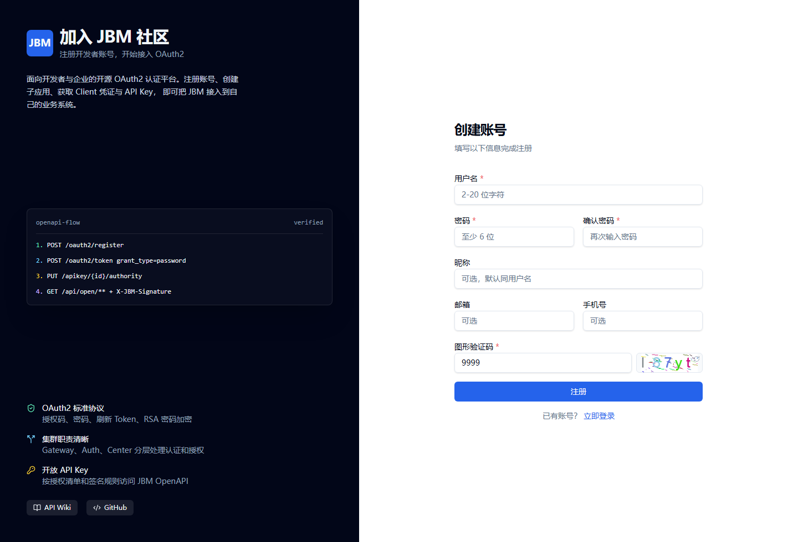

# JBM

[](https://www.apache.org/licenses/LICENSE-2.0)
[](https://gitee.com/numen06/JBM)
[](https://github.com/numen06/JBM)
[]()
[]()
[]()

JBM（Java Business Model）是一个面向中大型项目的分布式微服务基础平台，提供统一认证授权、RBAC 权限、网关治理、多租户、子应用接入与开放 API 能力。JBM7 已升级为 Spring Cloud + OAuth2 + Vue 3 的前后端分离架构，适合做企业中台、SaaS 平台和开源社区平台的认证授权底座。

## 界面预览

### 开源社区首页


### 登录与注册




### JBM OpenAPI Wiki


## 新功能亮点

- **开源社区平台首页**：新增公开首页、注册入口、登录入口和 OpenAPI Wiki，用户不登录也能了解平台能力。
- **注册登录全流程**：从注册账号、RSA 加密密码传输、OAuth2 密码模式登录，到进入管理控制台完成闭环。
- **JBM OpenAPI Wiki**：提供注册、登录、创建子应用、申请 API Key、授权 API、签名调用和租户隔离说明。
- **子应用接入**：为业务系统发放 OAuth2 Client，统一管理 `client_id`、`client_secret`、回调地址和 Scope。
- **API Key 授权访问**：支持个人 API Key、应用 API Key、client_token、签名调用和越权拒绝。
- **多租户与数据隔离**：按租户、组织、角色、用户上下文隔离平台资源与业务数据。
- **分布式集群信任边界**：Gateway、Auth、Center 分层处理认证授权，后端不再盲信外部伪造的内部请求头。
- **前端升级**：`jbm-admin-vue` 使用 Vue 3、Vite、TypeScript、Tailwind CSS 和 Lucide 图标。

## 平台能力

| 能力 | 说明 |
| --- | --- |
| 统一认证授权 | OAuth2 授权码、密码、刷新令牌、client credentials 等模式 |
| 密码加密传输 | 前端获取 RSA 公钥后加密密码，提交 `X-Password-Encrypted: true` |
| RBAC 权限 | 用户、角色、菜单、按钮、开放 API 权限点统一管理 |
| 多租户 | 租户、组织、用户、应用、API Key 与数据访问上下文隔离 |
| 子应用接入 | 创建 OAuth2 Client，配置回调地址、Scope 和授权策略 |
| JBM OpenAPI | 通过 API Key、签名、client_token 对第三方开放接口 |
| 网关治理 | Spring Cloud Gateway 统一入口、动态路由、限流、IP 限制 |
| 集群可信调用 | 服务间请求使用 Sa-Token IdToken 或网关验证后的 API Key 上下文 |
| 审计与日志 | 登录、操作、API 调用链路可记录、可追踪 |
| 扩展字段 | 支持动态字段、扩展表单和业务实体扩展 |

## 技术栈

| 层级 | 技术 |
| --- | --- |
| 后端 | Spring Boot 2.6.4、Spring Cloud 2021、Spring Security、Sa-Token、OAuth2 |
| 网关 | Spring Cloud Gateway |
| 前端 | Vue 3、Vite、TypeScript、Pinia、Vue Router、Tailwind CSS |
| 持久层 | MyBatis、MyBatis-Plus、JPA、Spring Data |
| 中间件 | Nacos、Redis、Druid、Quartz、Zookeeper |
| 工具 | Hutool、Liquibase、Maven、多模块依赖管理 |

## 项目结构

```text
JBM7
├── jbm-admin-vue                 # Vue 3 管理后台、公开首页、注册登录、OpenAPI Wiki
├── jbm-cluster                   # 分布式集群平台服务
│   ├── jbm-cluster-platform-auth # Auth：OAuth2、登录、注册、Token
│   ├── jbm-cluster-platform-center
│   │                               # Center：用户、角色、菜单、应用、API Key、开放权限
│   └── jbm-cluster-platform-gateway
│                                   # Gateway：统一入口、路由、鉴权、签名校验
├── jbm-framework-core            # 框架核心与基础工具
├── jbm-framework-autoconfigure   # Spring Boot 自动配置集合
├── jbm-framework-micro           # 微服务基础能力
├── jbm-framework-dependencies    # 统一依赖版本管理
├── docs                          # 架构、测试、使用文档
└── scripts                       # 本地集群启动、REST 回归、接入流测试脚本
```

## 快速启动

### 1. 启动后端集群

本地开发推荐使用 `jaja7` profile，需要同时启动 Auth、Center、Gateway。

```powershell
python scripts\jbm_cluster_ops.py restart
python scripts\jbm_cluster_ops.py status
```

默认端口：

| 服务 | 端口 | 说明 |
| --- | --- | --- |
| Gateway | `6060` | 前端与第三方统一访问入口 |
| Auth | `5555` | OAuth2、登录、注册、验证码 |
| Center | `7777` | 用户、角色、菜单、应用、API Key 等业务 API |
| Vue | `5173` | 前端开发服务 |

### 2. 启动前端

```bash
cd jbm-admin-vue
npm install --registry https://registry.npmjs.org
npm run dev -- --host 127.0.0.1 --port 5173
```

访问地址：

- 首页：<http://127.0.0.1:5173/>
- 登录：<http://127.0.0.1:5173/login>
- 注册：<http://127.0.0.1:5173/register>
- OpenAPI Wiki：<http://127.0.0.1:5173/docs>

### 3. 默认账号

| 类型 | 值 |
| --- | --- |
| 管理员 | `admin` |
| 默认密码 | `Admin@123` |
| 默认 Client ID | `demo` |
| 默认 Client Secret | `demo123` |
| 开发验证码 | `9999` |

## OpenAPI 接入流程

1. 访问注册页创建 JBM 开发者账号。
2. 登录控制台，申请成为开发者。
3. 创建业务子应用，获取 `client_id` 与 `client_secret`。
4. 创建个人或应用 API Key。
5. 管理员为 API Key 授权可访问的 OpenAPI 权限点。
6. 使用 `client_token` 或签名请求访问 Gateway。
7. Gateway 校验 Token、签名、时间戳、nonce、授权清单后转发后端服务。

示例：

```http
POST http://127.0.0.1:6060/oauth2/register
Content-Type: application/x-www-form-urlencoded
X-Password-Encrypted: true

userName=developer&password=<RSA_ENCRYPTED>&vcode=9999&client_id=demo&client_secret=demo123
```

```http
GET http://127.0.0.1:6060/api/open/v1/user/profile
X-JBM-Api-Key: ak_xxx
X-JBM-Timestamp: 1760000000000
X-JBM-Nonce: 1d48f4c2-9a2c-47ac
X-JBM-Signature: hex(hmac_sha256(secret, canonicalRequest))
```

## 本地验证

本轮升级已完成前后端实测，验证结果记录在 [.cursor/jbm-verification-summary.md](.cursor/jbm-verification-summary.md)。

常用回归命令：

```powershell
# 前端构建
cd jbm-admin-vue
npm run build

# 后端全量 REST 回归
cd ..
python scripts\run_all_rest_tests.py --profile jaja7 --wait 60 --base-url http://127.0.0.1:6060 --auth-url http://127.0.0.1:5555

# API Key / OpenAPI 接入链路
$env:ADMIN_PASSWORD='Admin@123'
$env:LOGIN_PASSWORD='Admin@123'
python scripts\run_api_key_flow_tests.py
```

已验证通过：

- Auth REST：OAuth2 smoke、核心 token、登出、锁定、Sa-Token 对齐。
- Center REST：用户、角色、菜单、权限、应用、网关、扩展字段、自定义表单。
- Feign Trust：坏 Bearer Token 携带内部头不能绕过；可信 IdToken/API Key 上下文可转发。
- User Permission：多用户登录、数据权限、动作权限、网关权限、隔离访问。
- API Key Flow：注册、开发者申请、审批、授权、个人 Key、应用 Key、client_token、签名调用、越权拒绝。

## 文档入口

- [项目架构](docs/项目架构.md)
- [Maven 构建与测试规范](docs/Maven构建与测试规范.md)
- [应用-菜单-权限关系梳理](docs/应用-菜单-权限关系梳理.md)
- [动态字段使用方案](docs/动态字段使用方案.md)
- [REST 测试说明](docs/testing/REST-TESTS-jaja7.md)
- [API Key Flow 测试报告](docs/testing/api-key-flow-jaja7/report.md)

## 贡献

欢迎提交 Issue 和 PR。建议先在本地使用 `jaja7` profile 跑通后端 REST 回归和前端构建，再提交变更。

```bash
git checkout -b feature/your-feature
```

PR 建议包含：

- 变更说明
- 截图或接口示例
- 已执行的测试命令与结果

## License

JBM 使用 [Apache License 2.0](https://www.apache.org/licenses/LICENSE-2.0)。
