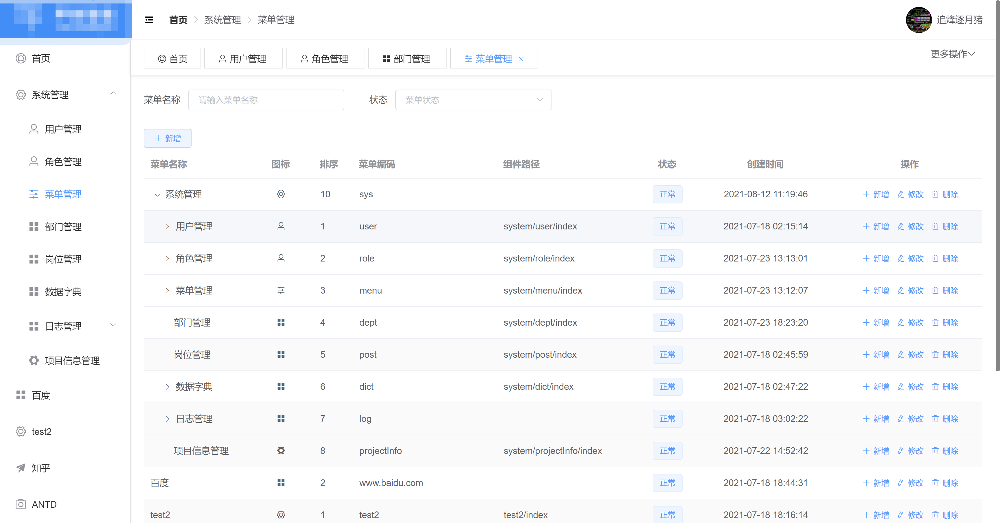

# JBM

[]()
[]()

```
2021年9月开放独立的web管理界面
陆续上传集群使用说明，希望更多的开发者加入更新
联系邮箱；numen06@qq.com
```

## 说明

- Java Business Model(JBM)
- 适合中大型项目开发，全分布式架构统一平台管理
- 支持多租户，多项目管理

## 使用说明文档

- JBM7随着使用越来越庞大和复杂正在不断完善文档
- [☆语雀使用说明文档](https://www.yuque.com/numen06/ksfcpy)，详细说明特性功能
  - JBM7在Docker中部署
  - JBM入门代码生成
  - JBM7新特性-集群定时任务
  - JBM7新特性-集群事件
  - 持续更新中

```
2021年9月开放独立的web管理界面
陆续上传集群使用说明，希望更多的开发者加入更新
联系邮箱；numen06@qq.com
```

## 故事

- 由于框架诞生之初是初期期spring boot 1.0时代，所以有很多兼容性问题，在spring boot 2.0走红之后，JBM5.0全面升级融合各大主流中间件的starter
- 4.x以前版本主要基于dubbo分布式体系，5.0将重心转移到spring cloud

## 项目组成

启动类添加自动生产代码注解,指定Entity的包和生成目录,自动生成C/S/M相关文件,并可以直接POST访问增删改查

```java
@EnableCodeAutoGeneate(entityPackageClasses = {BigscreenView.class}, targetPackage = "com.jbm.cluster.bigscreen")
```

## Docker集群快速部署

集群部署之前需要中间件:Nacos,Redis等

1. 部署平台中心服务

```bash
docker run -itd --restart=always --name jbm-cluster-platform-center -v /opt/app/jbm-cluster-platform-center:/root -p 7777:7777 --privileged=true registry.cn-hangzhou.aliyuncs.com/51jbm/jbm-cluster-platform-center --spring.profiles.active=jbm
```

2. 部署权限认证服务

```bash
docker run -itd --restart=always --name jbm-cluster-platform-auth -p 5555:5555 --privileged=true registry.cn-hangzhou.aliyuncs.com/51jbm/jbm-cluster-platform-auth --spring.profiles.active=jbm
```

3. 部署文档服务

```bash
docker run -itd --restart=always --name jbm-cluster-platform-doc --privileged=true registry.cn-hangzhou.aliyuncs.com/51jbm/jbm-cluster-platform-doc --spring.profiles.active=jbm
```

4. 部署网关服务

```bash
docker run -itd --restart=always --name jbm-cluster-platform-gateway -p 6666:6666 --privileged=true registry.cn-hangzhou.aliyuncs.com/51jbm/jbm-cluster-platform-gateway --spring.profiles.active=jbm
```

5. 部署其他服务

```bash
#日志收集服务
docker run -itd --restart=always --name jbm-cluster-platform-logs -p 3312:3312 --privileged=true registry.cn-hangzhou.aliyuncs.com/51jbm/jbm-cluster-platform-logs --spring.profiles.active=jbm

#推送消息服务
docker run -itd --restart=always --name jbm-cluster-platform-push -p 3313:3313 --privileged=true registry.cn-hangzhou.aliyuncs.com/51jbm/jbm-cluster-platform-push --spring.profiles.active=jbm
```

一键部署方案请关注更新

## 业务功能

| 功能 | 介绍                                             |
|---|------------------------------------------------|
| 用户管理 | 用户是系统操作者，该功能主要完成系统用户配置。                        |
| 部门管理 | 配置系统组织机构（公司、部门、小组），树结构展现支持数据权限。                |
| 岗位管理 | 配置系统用户所属担任职务。                                  |
| 缓存监控 | 对系统的缓存信息查询，命令统计等。                              |
| 连接池监视 | 监视当前系统数据库连接池状态，可进行分析SQL找出系统性能瓶颈。               |

## 贡献代码

欢迎各路英雄豪杰 `PR` 代码 请提交到 `dev` 开发分支 统一测试发版

