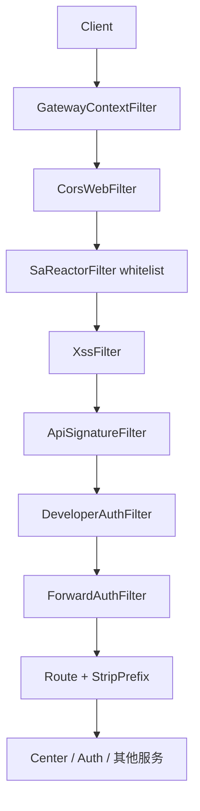

# JBM 网关架构说明

模块：`jbm-cluster-platform-gateway`  
默认端口：`6060`（`jaja7` profile：`7777`）  
技术栈：Spring Cloud Gateway（WebFlux）+ Sa-Token + Sentinel + 动态 JDBC 路由

## 1. 请求处理链

### 1.1 WebFilter 层（路由匹配前）

| 顺序 | 组件 | 说明 |
|------|------|------|
| 1 | `GatewayContextFilter` | 缓存 JSON/Form 请求体到 `GatewayContext`，供签名与日志使用 |
| 2 | `RemoveGatewayContextFilter` | 请求结束后清理 `GatewayContext` |
| 3 | `AccessLogFilter` | 装饰响应体，异步写入访问日志（MQ） |
| 4 | `CorsWebFilter` | 全局 CORS |

### 1.2 Sa-Token 网关过滤器

| 组件 | 说明 |
|------|------|
| `SaReactorFilter`（`SaAuthFilter` 注册） | **不做** `StpUtil.checkLogin()`；仅按 `security.ignore.whites` 排除路径。登录校验在下游服务完成 |

### 1.3 GlobalFilter 层（路由匹配后）

| Order | 组件 | 说明 |
|-------|------|------|
| -100 | `XssFilter` | JSON 请求体 XSS 过滤（`security.xss.enabled`） |
| -50 | `ApiSignatureFilter` | RSA 签名校验（`jbm.api.check-sign`） |
| -45 | `DeveloperAuthFilter` | API Key 接口授权范围（`jbm.api.check-auth`） |
| -40 | `ForwardAuthFilter` | 追加 `Satoken-Id-Token`、`X-Internal-Service`、`X-Gateway-Api-Key-Id` 等 |

路由级过滤器（动态路由）：`StripPrefix=1`（去掉路径第一段前缀，如 `/admin/foo` → `/foo`）

## 2. 路由来源

### 2.1 静态路由（Profile YAML）

示例 `bootstrap-jaja7.yml`：

- `jaja7-center-local` → `http://127.0.0.1:8888`，路径前缀 `/user/**`、`/gateway/**` 等
- `jaja7-auth-local` → `http://127.0.0.1:5555`，路径 `/oauth2/**`、`/captcha/**` 等

`spring.cloud.gateway.discovery.locator.enabled` 默认为 `false`，不以服务名自动建路由。

### 2.2 动态路由（数据库）

- 表：`gateway_route`（`status=1` 生效）
- 加载类：`JdbcRouteDataSource` → `DynamicRouteDefinitionLocator`
- 触发刷新：`ApplicationReadyEvent`、`RemoteRefreshRouteEvent`（集群总线）
- 每条路由：`Path` 断言 + `StripPrefix=1` + `lb://{serviceId}` 或显式 `url`

### 2.3 限流路由

- 表：`gateway_rate_limit_api` + `gateway_rate_limit` + `base_api`
- 额外过滤器：`RequestRateLimiter`，key 解析器 Bean：`pathKeyResolver`（按请求路径）
- `replenishRate = max(limitQuota / refreshInterval, 1)`

## 3. 白名单配置对照

| 配置键 | 消费者 | 用途 |
|--------|--------|------|
| `security.ignore.whites` | `SaReactorFilter` | 网关层路径排除 |
| `jbm.api.sign-ignores` | `ApiSignatureFilter` | 跳过 RSA 签名 |
| `jbm.api.auth-ignores` | `DeveloperAuthFilter` | 跳过 API Key 授权校验 |
| `jbm.api.permit-all` | 下游 `JbmSecurityConfiguration` | 微服务 Servlet 过滤器放行 |
| `SaAuthFilter.excludeUrls` | 硬编码补充 | favicon、actuator |
| `StreamAccessLogService.ignores` | 访问日志 | 不记日志的路径 |

公共放行路径（各环境应保持一致）：

- 登录/注册/会话：`/**/login/**`、`/user/registrations`、`/user/sessions/**`
- OAuth：`/oauth2/**`
- 验证码：`/captcha/**`、`/code`
- 内部：`/internal/dev/**`、`/internal/trust/**`
- 运维：`/actuator/**`

## 4. 认证与互信

### 4.1 网关 → 下游

`ForwardAuthFilter` 为每个转发请求追加：

- `Satoken-Id-Token`：服务间互信（`SaIdUtil`）
- `X-Internal-Service` / `X-Internal-Instance`：调用方身份
- `X-Gateway-Api-Key-Id`：API Key 场景（由 `DeveloperAuthFilter` 写入 exchange 属性）

保留用户 `Authorization: Bearer ...`，供下游绑定登录态。

### 4.2 下游服务校验（Servlet）

`JbmSecurityConfiguration` + `SaOAuthFilterAuthStrategy`：

1. 有有效用户 Bearer → `StpUtil` / OAuth2 AccessToken / JWT
2. 无 Bearer → Gateway 已授权 API Key（`X-Gateway-Api-Key-Id` + `X-Internal-Service`）
3. 无 Bearer → 有效 Id-Token + 内部 Header
4. 否则 401

`isGatewayTrustedRequest`（`JbmSecurityConfiguration`）：无 Authorization 且 Id-Token 有效，或 Gateway API Key Header 齐全时，走快速互信分支。

### 4.3 Feign 服务间调用

`AppPreRequestInterceptor`：无用户 Token 时注入 Id-Token；访问 Gateway 元数据接口（`/apikey`、`/api?`）时强制内部互信、移除第三方 Bearer。

## 5. 环境与端口

| Profile | Gateway | Center | Auth | 说明 |
|---------|---------|--------|------|------|
| 默认 | 6060 | Nacos 发现 | Nacos 发现 | 动态 DB 路由为主 |
| jaja7 | 7777 | 8888 静态 | 5555 静态 | 本地联调，`check-sign`/`check-auth` 开启 |

## 6. 异常与限流

- `GatewayExceptionHandler`：统一 JSON 错误体（`WebExceptionResolve`）
- `SentinelFallbackHandler`：Sentinel 阻断返回 429
- `OpenSignatureException` → HTTP 400

## 7. 相关源码索引

| 路径 | 职责 |
|------|------|
| `gateway/config/GatewayConfig.java` | CORS、动态路由 Bean、`pathKeyResolver` |
| `gateway/filter/SaAuthFilter.java` | 网关 Sa-Token 白名单 |
| `gateway/filter/ApiSignatureFilter.java` | 签名 |
| `gateway/filter/DeveloperAuthFilter.java` | API Key 授权 |
| `gateway/filter/ForwardAuthFilter.java` | 互信 Header |
| `gateway/locator/DynamicRouteDefinitionLocator.java` | DB 路由与限流 |
| `common-security/.../JbmSecurityConfiguration.java` | 下游认证入口 |
| `common-satoken/.../SaOAuthFilterAuthStrategy.java` | Token / Id-Token / API Key 策略 |

## 8. 维护注意

1. 新增公开接口时，同步更新 `security.ignore.whites`、`sign-ignores`、`auth-ignores`（及下游 `permit-all` 如需要）。
2. 动态路由路径需与 `base_api.path`、`StripPrefix` 规则一致，否则 `ApiFilter` 元数据与授权路径可能对不上。
3. 限流依赖 Redis 与 `pathKeyResolver` Bean；缺 Bean 会导致限流路由启动失败。
4. 网关不校验登录是**有意设计**；勿在未评估下游服务的情况下恢复 `StpUtil.checkLogin()`。
