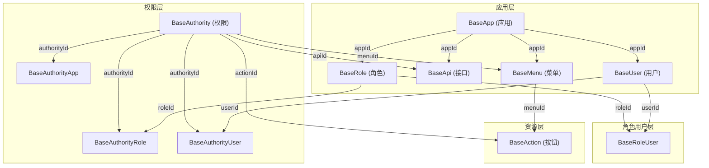
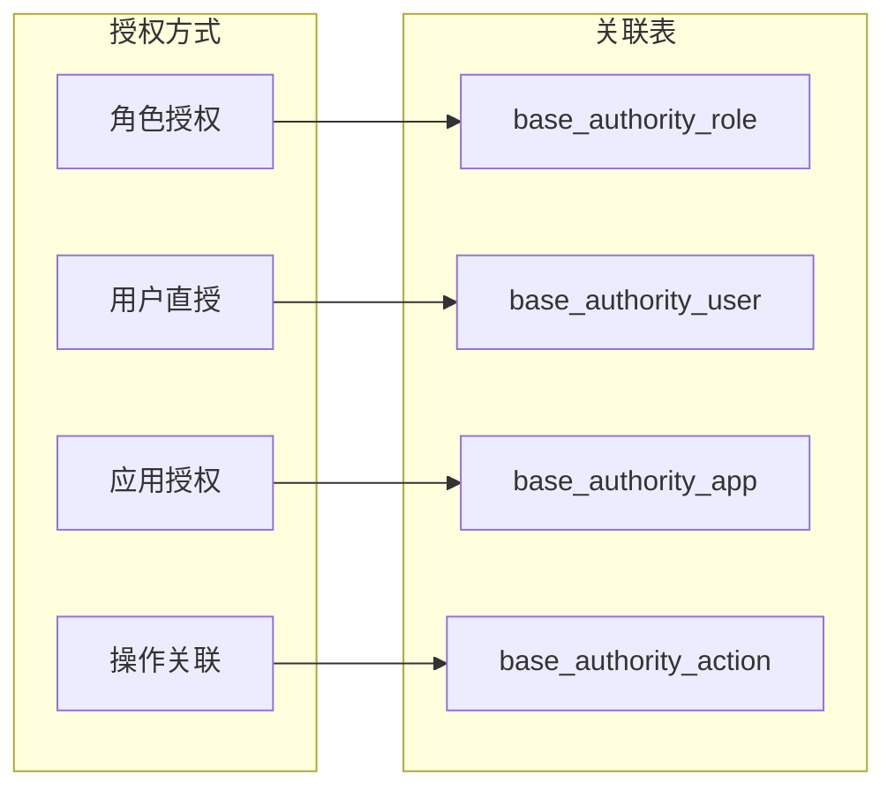
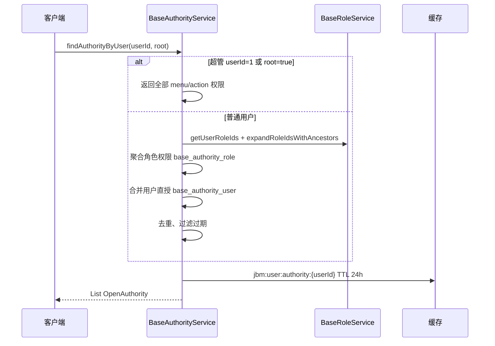

# JBM7 应用-菜单-权限 关系梳理

> 版本: 7.3.0-SNAPSHOT | 更新时间: 2026-05-16  
> 相关文档: [Token 认证全链路](../jbm-cluster/jbm-cluster-platform/jbm-cluster-platform-auth/docs/token-auth-full-chain.md) | [项目架构](ARCHITECTURE.md)

---

## 一、核心数据模型

### 1. 三种权限资源类型

| 类型 | 说明 | 对应实体 | 权限标识格式 |
|------|------|---------|-------------|
| `menu` | 菜单权限 | `BaseMenu` | `MENU_{menuCode}` |
| `action` | 按钮/操作权限 | `BaseAction` | `ACTION_{actionCode}` |
| `api` | API 接口权限 | `BaseApi` | `API_{apiCode}` |

枚举定义：`com.jbm.cluster.api.constants.ResourceType`

权限前缀常量：`JbmSecurityConstants`（`MENU_` / `ACTION_` / `API_` / `ROLE_`）

### 2. 核心实体关系



### 3. 表结构说明

Liquibase 脚本目录：`jbm-cluster-common-mysql/src/main/resources/db/cluster-rbac/changes/`

| 表名 | 作用 | 关键字段 |
|------|------|---------|
| `base_app` | 应用/客户端 | `appId`, `apiKey`(client_id), `secretKey`, `appType`, RSA 公私钥 |
| `base_menu` | 菜单资源 | `menuId`, `menuCode`, `appId`, `parentId`, `path` |
| `base_action` | 按钮/操作 | `actionId`, `actionCode`, `menuId` |
| `base_api` | API 接口 | `apiId`, `apiCode`, `serviceId`, `path`, `requestMethod` |
| `base_authority` | 权限记录 | `authorityId`, `authority`, `resourceType`, `menuId`/`apiId`/`actionId` |
| `base_role` | 角色 | `roleId`, `roleCode`, `parentId`(继承) |
| `base_role_user` | 用户-角色关联 | `userId`, `roleId` |
| `base_authority_role` | 权限-角色授权 | `authorityId`, `roleId`, `expireTime` |
| `base_authority_user` | 权限-用户授权 | `authorityId`, `userId`, `expireTime` |
| `base_authority_app` | 权限-应用授权 | `authorityId`, `appId`, `expireTime` |
| `base_authority_action` | 权限-操作关联 | `authorityId`, `actionId`, `expireTime` |

`base_authority.resource_type` 由迁移脚本 `V4__rbac_alter_resource_type.sql` 回填：`menu` / `action` / `api`。

---

## 二、应用与菜单的关系

### 1. 应用隔离机制

- 菜单、API、用户、角色等主数据均可带 `appId`，实现多应用隔离。
- `base_menu.app_id` 标识菜单归属应用；`app_id IS NULL` 表示**平台公共菜单**（所有应用可见）。
- 登录后查菜单时，以当前 `JbmLoginUser.appId` 过滤（见第四节）。

### 2. 菜单树形结构

菜单通过 `parentId` 构成树；初始化种子见 `SystemDataInitializer`：

```
平台管理
├── 系统管理
│   ├── 用户管理   → MENU_user_manage
│   ├── 角色管理   → MENU_role_manage
│   ├── 权限管理   → MENU_auth_manage
│   └── 开发者管理 → MENU_developer_manage
└── 应用管理
    └── 应用列表   → MENU_app_manage
```

创建菜单时调用 `BaseAuthorityService.saveOrUpdateAuthority(menuId, ResourceType.menu)` 同步生成权限记录。

### 3. 按钮与菜单

- `base_action.menu_id` 指向所属菜单。
- 按钮权限独立为 `ACTION_{actionCode}`，可单独授权给角色/用户。

---

## 三、权限授权机制

### 1. 四种授权方式

| 方法 | 关联表 | 说明 |
|------|--------|------|
| `addAuthorityRole(roleId, expireTime, authorityIds...)` | `base_authority_role` | 角色批量授权，先清空再写入 |
| `addAuthorityUser(userId, expireTime, authorityIds...)` | `base_authority_user` | 用户直授；跳过已被角色覆盖的权限 |
| `addAuthorityApp(appId, expireTime, authorityIds...)` | `base_authority_app` | 应用级授权（开放能力等） |
| `addAuthorityAction(actionId, authorityIds...)` | `base_authority_action` | 权限与操作资源关联 |

所有授权表均支持 `expireTime`（`null` 表示长期有效）。



### 2. 权限创建流程

```
资源创建/更新
  → saveOrUpdateAuthority(resourceId, resourceType)
  → 写入 base_authority（authority 字段带前缀）
```

示例：

| 资源 | 编码 | 权限标识 |
|------|------|----------|
| 菜单 | `user_manage` | `MENU_user_manage` |
| 按钮 | `user_add` | `ACTION_user_add` |
| API | `user:list` | `API_user:list` |

删除资源时调用 `removeAuthority(resourceId, resourceType)` 级联清理权限及关联授权。

### 3. 角色继承

- `BaseRole.parentId` 支持角色层级。
- `BaseRoleService.expandRoleIdsWithAncestors(roleIds)` 递归收集祖先角色 ID。
- **有效权限** = 所有角色（含祖先）的权限 ∪ 用户直授权限（去重）。

---

## 四、权限计算与登录会话

### 1. 用户权限计算（`findAuthorityByUser`）



超管常量：`JbmConstants.ROOT_USER_ID = 1L`，`ROOT_ROLE_ID = 1L`。

### 2. 菜单权限计算（`findAuthorityMenuByUser`）

入口：`CurrentUserController` → `/current/user/menu`

```java
baseAuthorityService.findAuthorityMenuByUser(
    loginUser.getUserId(),
    loginUser.getAppId(),
    fullMenu  // 超管或用户名为 admin
);
```

- **超管**：`findAuthorityMenu(null, appId, false)`，当前应用下全部菜单。
- **普通用户**：按角色 + 用户直授分别查菜单，合并去重后按 `priority` 排序。

**SQL 过滤规则**（`BaseAuthorityRoleMapper.xml` / `BaseAuthorityUserMapper.xml`）：

```sql
-- appId 不为空时
AND (m.app_id = #{appId} OR m.app_id IS NULL)

-- appId 为空时
AND m.app_id IS NULL
```

即：登录用户看到 **本应用菜单 + 公共菜单**。

### 3. 登录用户模型（`JbmLoginUser`）

| 字段 | 说明 |
|------|------|
| `authorities` | 权限标识集合（兼容别名 `menuPermission`） |
| `roles` | 角色编码集合 |
| `roleIds` | 角色 ID 集合 |
| `appId` | 当前登录应用 ID |
| `clientId` | OAuth2 client_id（即 `BaseApp.apiKey`） |

**loginId 格式**（Sa-Token 会话主键）：

```
{userType}:{appId}:{userId}
```

同一用户在不同 `appId` 下会产生不同 `loginId`，对应**独立 Token 会话**。

### 4. Sa-Token 集成

- `SaPermissionImpl` 实现 `StpInterface`：`getPermissionList` → `authorities`，`getRoleList` → `roles`。
- 方法级校验示例：`@SaCheckPermission("MENU_user_manage")`。
- 权限变更方法带 `@CacheEvict`，缓存键前缀：`JbmCacheConstants.USER_AUTHORITY_KEY`。

---

## 五、不同应用登录的差异

前端登录必须携带 `client_id`（对应 `BaseApp.apiKey`）。

```
username + password(RSA) + client_id
    │
    ▼
BaseAppPreprocessing.getAppByKey(client_id) → BaseApp
    │
    ├─ 设置 JbmLoginUser.appId / clientId
    ├─ 使用 BaseApp 私钥解密密码（每应用独立 RSA 密钥对）
    └─ LoginHelper.login → StpUtil.login("{userType}:{appId}:{userId}")
```

| 维度 | 不同 app 的表现 |
|------|----------------|
| Token 会话 | 不同 `loginId`，互踢/互不影响 |
| 菜单 | 仅 `app_id = 当前appId` 或 `app_id IS NULL` |
| 密码传输 | 各应用公钥加密、私钥解密 |
| OAuth 客户端 | 独立 `apiKey` + `secretKey`（支持 BCrypt） |

OAuth 入口：`OAuth2ServerController`（`/oauth2/doLogin`）、`SysLoginService.checkLoginIdentity`。

---

## 六、关键代码索引

| 功能 | 路径 |
|------|------|
| 权限实体 | `jbm-cluster-api-basic/.../entitys/basic/BaseAuthority.java` |
| 菜单实体 | `jbm-cluster-api-basic/.../entitys/basic/BaseMenu.java` |
| 应用实体 | `jbm-cluster-api-basic/.../entitys/basic/BaseApp.java` |
| 权限服务 | `jbm-cluster-common-mysql/.../service/impl/BaseAuthorityServiceImpl.java` |
| 角色服务 | `jbm-cluster-common-mysql/.../service/impl/BaseRoleServiceImpl.java` |
| 登录用户 | `jbm-cluster-api-basic/.../model/auth/JbmLoginUser.java` |
| 登录助手 | `jbm-cluster-common-satoken/.../utils/LoginHelper.java` |
| 当前用户菜单 | `jbm-cluster-platform-center/.../controller/CurrentUserController.java` |
| 系统初始化 | `jbm-cluster-common-mysql/.../init/SystemDataInitializer.java` |
| Mapper（菜单按 app 过滤） | `jbm-cluster-common-mysql/src/main/resources/mapper/BaseAuthorityRoleMapper.xml` |
| 表结构迁移 | `jbm-cluster-common-mysql/src/main/resources/db/cluster-rbac/changes/V1__rbac_tables.sql` |

---

## 七、总结

### 应用-菜单-权限 三者关系

1. **应用（App）**：顶层隔离单位；OAuth `client_id` 映射为 `appId`。
2. **菜单（Menu）**：挂在应用下的可导航资源；公共菜单 `app_id` 为空。
3. **权限（Authority）**：对 menu/action/api 的统一抽象；通过角色或用户（及可选应用）授权。

### 端到端流程

```
资源 CRUD → saveOrUpdateAuthority → 角色/用户/应用授权
    → 用户带 client_id 登录 → 计算 authorities + 按 appId 过滤菜单
    → 写入 JbmLoginUser / TokenSession → Sa-Token 注解校验
```

### 设计要点

- **多应用隔离**：`appId` + 菜单 SQL 过滤 + 独立 loginId。
- **角色继承**：`parentId` 向上展开角色权限。
- **权限过期**：授权表 `expire_time`。
- **缓存**：用户权限 24 小时；授权变更 `@CacheEvict` 失效。
