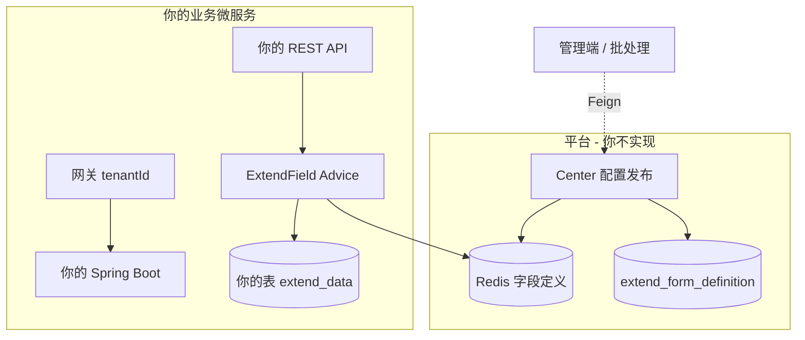

# 动态字段（扩展字段）使用方案

> 适用版本：7.3.x  
> **读者**：新建或改造中的 **业务微服务**（非 Center 平台本身）  
> **前提**：字段定义由 **Center**（`jbm-cluster-platform-center`）或运营后台发布到 **Redis**；本服务只负责 **运行时消费**。

---

## 1. 你在整体架构中的位置



| 职责 | 谁做 | 你的服务 |
|------|------|----------|
| 表单设计、定义入库 | Center / CustomForms | **不做** |
| 发布到 Redis | Center | **不做**（仅管理端 Feign 调 Center，见第 8 节） |
| 读 Redis 拆分请求 | 各业务微服务 | **做** |
| 业务值持久化 | 各业务微服务 | **做**（`extend_data` 列） |

**原则**：运行时 **不回调 Center**；改字段定义后 Redis 已更新，**无需重启**你的服务。

---

## 2. 接入清单（按顺序打勾）

| # | 项 | 说明 |
|---|-----|------|
| 1 | Maven 依赖 | `extendfield` + `redis`（见 3.1） |
| 2 | 启动类注解 | `@EnableExtendField(source = REDIS)` |
| 3 | 配置 | `jbm.extend-field`（见 3.2），`tenant.header` 与网关一致 |
| 4 | 实体与表 | 继承 `MasterDataEntity`，表加 `extend_data`，`autoResultMap = true` |
| 5 | 约定 formCode | 与 Center 发布时一致（如 `sales_order_form`） |
| 6 | 网关租户 | 请求带 `tenantId`（或与 Center 发布时同一租户） |
| 7 | 联调前确认 | Redis 已有 `extend_field:form:{tenantId}:{formCode}` |
| 8 | API 契约 | 写入：body 平铺 + `formCode`；查询：可用 `extend` |

字段定义由运维/产品在 Center 配置好后，你再做 7、8。

---

## 3. 工程改造

### 3.1 Maven

在业务微服务 `pom.xml` 增加（若已依赖 `jbm-cluster-node-basic`，仍需确认是否传递 `extendfield` / `redis`，无则显式添加）：

```xml
<dependency>
  <groupId>com.jbm</groupId>
  <artifactId>jbm-framework-autoconfigure-extendfield</artifactId>
</dependency>
<dependency>
  <groupId>com.jbm</groupId>
  <artifactId>jbm-framework-autoconfigure-redis</artifactId>
</dependency>
<!-- 管理端要调 Center 发布接口时 -->
<dependency>
  <groupId>com.jbm</groupId>
  <artifactId>jbm-cluster-api-basic</artifactId>
  <version>${project.version}</version>
</dependency>
```

### 3.2 启动类

```java
import jbm.framework.boot.autoconfigure.extendfield.FieldDefinitionSource;
import jbm.framework.boot.autoconfigure.extendfield.annotation.EnableExtendField;

@EnableExtendField(source = FieldDefinitionSource.REDIS)
@SpringBootApplication
public class YourBizApplication {
}
```

### 3.3 配置（Nacos `common.properties` 或本服务 `application-*.yml`）

```yaml
jbm:
  extend-field:
    enabled: true
    source: REDIS
    auto-flatten: true
    sync-local-to-redis-on-startup: false
    # 业务微服务不要提供定义管理 API，保持默认 true 即可；若与 Center 同进程再关
    builtin-definition-controller-enabled: true
    tenant:
      enabled: true
      header: tenantId          # 必须与网关下发的 Header 名一致
      default-tenant-id: "0"
      use-default-when-missing: true
```

与 Center、网关 **共用同一 Redis** 实例（或同一集群），否则读不到定义。

### 3.4 实体与数据库（本服务库表）

```java
@Data
@TableName(value = "your_biz_table", autoResultMap = true)
public class YourEntity extends MasterDataEntity {
    private Long id;
    private String orderNo;
    // extendData、extendQuery 在父类 MasterDataEntity
}
```

Liquibase 为本表增加列（示例）：

```yaml
- addColumn:
    tableName: your_biz_table
    columns:
      - column:
          name: extend_data
          type: JSON
```

约定见 [masterdata-orm-7.3.md](masterdata-orm-7.3.md)。

### 3.5 启用 Feign（仅管理端需要调 Center 时）

```java
@EnableFeignClients(basePackages = "com.jbm.cluster.api.service.feign.client")
```

---

## 4. 运行时 API 契约（你的 Controller 无需改 URL）

框架通过 `ExtendFieldRequestBodyAdvice` / `ResultExtendAop` 自动处理 JSON body 与 `ResultBody` 响应。

### 4.1 新增 / 修改

扩展字段与固定字段 **同一层平铺**，必须带 **formCode**（可与 Center 约定一个或多个）：

```json
POST /api/your/orders
Content-Type: application/json
tenantId: 1001

{
  "formCode": "sales_order_form",
  "orderNo": "ORD-001",
  "title": "标题",
  "contactPhone": "13800001111",
  "region": "华东"
}
```

- `contactPhone`、`region` 须在 Center 已为该租户发布的定义中。
- 入库后落在 `extend_data`；响应在 `auto-flatten: true` 时仍平铺展示。

### 4.2 查询

```json
{
  "formCode": "sales_order_form",
  "orderNo": "ORD-001",
  "extend": {
    "region": "华东"
  }
}
```

`extend` 会转为实体上的 **extendQuery**（非持久化），供 Mapper 动态条件使用（需自行在 XML 中引用）。

### 4.3 响应

```json
{
  "success": true,
  "result": {
    "orderNo": "ORD-001",
    "title": "标题",
    "contactPhone": "13800001111",
    "region": "华东"
  }
}
```

`extend_data` 在库内为 JSON，对外通常已平铺。

---

## 5. 多租户（与网关、Center 对齐）

| 项 | 约定 |
|----|------|
| Redis 作用域 | `{tenantId}:{formCode}`，键前缀 `extend_field:form:` |
| 请求租户 | 网关 Header **`tenantId`**（可配置为其它名，与 `jbm.extend-field.tenant.header` 一致） |
| 无租户头 | `use-default-when-missing: true` 时用 **`0`**（默认模块） |
| 发布定义时 | Center 侧必须用 **同一 tenantId** 发布，否则 Advice 读不到字段 |

**同一 URL、同一 formCode**，不同租户可有不同字段列表。

---

## 6. formCode 约定

| 规则 | 说明 |
|------|------|
| 命名 | 建议 `业务域_场景`，如 `sales_order_form` |
| 来源 | 与 Center `POST /extend-field/forms/{formCode}` 或 CustomForms 的 `code` **完全一致** |
| 多个表单 | 同一实体不同接口可使用不同 `formCode` |
| 前端 | 保存定义后从 Center 拉字段列表渲染；提交时仍平铺 + `formCode` |

---

## 7. 联调与验收

### 7.1 发布前（平台侧）

由 Center 或管理端完成（参见 [Center 接入说明](../jbm-cluster/jbm-cluster-platform/jbm-cluster-platform-center/docs/EXTEND_FIELD_INTEGRATION.md)）：

1. 在 Center 保存并发布 `formCode`。
2. 确认 Redis 存在（示例 tenant `1001`）：
   - `extend_field:form:1001:sales_order_form`
   - `extend_field:names:1001:sales_order_form`

### 7.2 你的服务自测

1. 启动服务，`jbm.extend-field.enabled=true`。
2. 带 `tenantId` + `formCode` 调用你的写接口。
3. 查库：`extend_data` 含 `contactPhone` 等键。
4. 查接口响应：字段已平铺。
5. 在 Center **增加字段并重新发布** 后，不重启你的服务再 POST 一次，新字段应能写入。

### 7.3 本地无 Center 时

参考 [双服务示例](../jbm-examples/EXTEND_FIELD_DUAL_SERVICES.md)：设计器写 Redis，业务服务只读（与生产形态一致）。

---

## 8. 管理端如何改字段定义（可选）

**业务运行时不要写 Redis**。仅后台、定时任务、实施工具通过 Feign 调 Center：

```java
@Autowired
private ExtendFormDefinitionClient extendFormDefinitionClient;

public void publishForm() {
    SaveExtendFormRequest req = new SaveExtendFormRequest();
    req.setFormName("销售订单扩展");
    req.setAutoPublish(true);
    FieldDefinition f = new FieldDefinition();
    f.setFieldName("contactPhone");
    f.setFieldType("string");
    f.setFieldLabel("联系电话");
    req.setFields(Collections.singletonList(f));
    // 请求需带与发布租户一致的 tenantId Header
    extendFormDefinitionClient.save("sales_order_form", req);
}
```

| Feign | `com.jbm.cluster.api.service.feign.client.ExtendFormDefinitionClient` |
| 服务名 | `jbm-cluster-platform-center` |
| 路径前缀 | `/extend-field/forms` |

Center 管理 API 一览：

| 方法 | 路径 | 用途 |
|------|------|------|
| POST | `/{formCode}` | 保存并发布 |
| PUT | `/{formCode}` | 更新并发布 |
| POST | `/{formCode}/publish` | 仅从库刷新 Redis |
| GET | `/{formCode}/definitions` | 预览 Redis 当前定义 |

---

## 9. 常见问题（业务微服务视角）

| 现象 | 排查 |
|------|------|
| 扩展字段没进 `extend_data` | `enabled`？Redis 有该 `tenantId:formCode`？body 有 `formCode`？字段名在定义中？ |
| 固定字段被误拆进 extend | 该键被发布进了定义；应在 Center 调整定义 |
| 响应没有平铺 | `auto-flatten`、返回是否 `ResultBody` |
| 启动报 Redis 相关 | 是否引入 `jbm-framework-autoconfigure-redis`，`redis.properties` 是否配置 |
| 与 Center 租户不一致 | 对比网关 `tenantId` 与 Center 发布时租户 |
| 想本服务自己管定义 | 不推荐；应走 Center。单机 demo 可用 `source: LOCAL` + yml `definitions`（见 examples） |

---

## 10. 你不需要做的事

- 在本服务实现 `/extend-field/forms`（Center 已提供）。
- 运行时 Feign 调 Center 拉定义（应读 Redis）。
- 把 CustomForms 全量 UI 元数据塞进 Redis（仅 `FieldDefinition` 子集）。
- 为每个扩展字段加物理列（统一 `extend_data` JSON）。

---

## 附录：设计表单在数据库中的结构

设计侧数据在 Center 库（`cluster-rbac` Liquibase **V5 / V6**）中分 **两套表**，职责不同；业务微服务自己的表里的 **`extend_data`** 存的是**用户填写的值**，不是表单设计。

```text
  [设计器 UI]                    [运行时]
  custom_forms ──┐
                 ├──► extend_form_definition ──publish──► Redis
  custom_forms_item ─┘                                      │
                                                            ▼
  你的业务表.order_no + extend_data  ◄── Advice 按 Redis 拆分写入
```

### A. `custom_forms`（表单主表，设计器）

| 列名 | 类型 | 说明 |
|------|------|------|
| id | BIGINT PK | 主键 |
| code | VARCHAR(64) | **formCode**，与运行时、Redis 作用域一致 |
| name | VARCHAR(128) | 表单显示名称 |
| menu_ids | VARCHAR(512) | 关联菜单 ID（可多个） |
| form_or_table | VARCHAR(32) | 字典 `form_table`：`form` / `table` |
| data_source | VARCHAR(256) | 数据源配置 |
| app_id, parent_id, level, leaf_path | | 继承 MasterData 树/应用字段 |
| create_time, update_time | TIMESTAMP | |
| extend_data | LONGTEXT | 主表级扩展 JSON（可选，非字段设计主载体） |

`saveData` 保存主表 + 明细后，若 `code` 非空且 `autoPublishExtendField=true`，会同步发布到 `extend_form_definition` 与 Redis。

### B. `custom_forms_item`（字段明细，设计器 UI 元数据）

| 列名 | 类型 | 说明 |
|------|------|------|
| id | BIGINT PK | 主键 |
| form_id | BIGINT | 所属 `custom_forms.id` |
| field_name | VARCHAR(64) | **运行时键名**，与 API 平铺字段一致 |
| label_name | VARCHAR(128) | 界面标签 |
| field_type | VARCHAR(32) | 字典 `field_type`：`text` / `number` / `date` / `radio` / `checkbox` |
| component_type | VARCHAR(32) | 字典 `component_type`：`input` / `select` / `datePicker` 等 |
| format | VARCHAR | 显示格式 |
| decimal_type, decimal_value | | 数字控件子选项 |
| choice_type, choice_value | | 单选/多选数据源 |
| date_type | | 日期控件子选项 |
| is_required | BOOLEAN | 是否必填 |
| is_show | BOOLEAN | 是否显示 |
| is_filter | BOOLEAN | 是否筛选项（发布时映射为 `queryable`） |
| field_belong | VARCHAR | 0 系统字段 / 1 自定义字段 |
| value_key, label_key, children_key | VARCHAR | 级联/选项映射 |
| code, app_id, create_time, update_time, extend_data | | MasterData 通用列 |

**说明**：此表保存**完整 UI 设计信息**（组件、校验、筛选项等），供设计器渲染；**不会整表写入 Redis**。

### C. `extend_form_definition`（运行时定义真源，按租户）

| 列名 | 类型 | 说明 |
|------|------|------|
| id | BIGINT PK | 主键 |
| tenant_id | BIGINT | 租户/应用 ID，与 Redis 作用域一致 |
| form_code | VARCHAR(64) | 表单编码，唯一约束 **(tenant_id, form_code)** |
| form_name | VARCHAR(128) | 表单名称 |
| fields_json | LONGTEXT | **字段定义 JSON 数组**（见下） |
| version | INT | 每次保存递增 |
| custom_form_id | BIGINT | 可选，关联 `custom_forms.id` |
| update_time | TIMESTAMP | 最后更新时间 |

**`fields_json` 元素结构**（`FieldDefinition`，Jackson 序列化）：

```json
[
  {
    "fieldName": "contactPhone",
    "fieldType": "string",
    "fieldLabel": "联系电话",
    "required": true,
    "queryable": false,
    "sortable": null,
    "defaultValue": null,
    "options": null
  },
  {
    "fieldName": "region",
    "fieldType": "string",
    "fieldLabel": "区域",
    "required": false,
    "queryable": true
  }
]
```

| 字段 | 含义 |
|------|------|
| fieldName | 请求/响应平铺键名，写入业务 `extend_data` 的 key |
| fieldType | 运行时类型：`string` / `number` / `date`（由设计器 `field_type` 映射） |
| fieldLabel | 展示标签 |
| required | 是否必填（来自 `is_required`） |
| queryable | 是否可作查询条件（来自 `is_filter`） |
| options | 扩展选项 Map（设计器未映射时多为 null） |

**CustomForms → 本表**：`CustomFormsItem` 经转换器只映射 `fieldName`、`fieldLabel`、`fieldType`、`required`、`queryable`；`component_type`、`choice_value` 等**留在 custom_forms_item**。

**直接 API 保存**：`POST /extend-field/forms/{formCode}` 的 body 即 `SaveExtendFormRequest`，`fields` 列表直接写入 `fields_json`，可不经过 CustomForms。

### D. Redis（发布后缓存，非 MySQL）

| Key | 内容 |
|-----|------|
| `extend_field:form:{tenantId}:{formCode}` | Hash：fieldName → FieldDefinition JSON 字符串 |
| `extend_field:names:{tenantId}:{formCode}` | Set：全部 fieldName |

业务微服务 Advice **只读 Redis**，不读 `custom_forms*` / `extend_form_definition` 表。

### E. 业务表 `extend_data`（你的微服务，非设计表）

业务实体继承 `MasterDataEntity` 后，表上增加：

```json
{
  "contactPhone": "13800001111",
  "region": "华东"
}
```

这是**某条业务记录**的扩展字段**值**，与 `fields_json`（字段**定义**）不是同一概念。

| 对比 | 设计/定义 | 业务数据 |
|------|-----------|----------|
| 存储位置 | `extend_form_definition.fields_json`、Redis | 各业务表 `extend_data` |
| 变更方式 | Center 设计器 / 管理 API | 用户提交业务 API |
| 是否含 component_type | CustomForms 明细有；Redis 无 | 无 |

---

## 11. 相关文档

| 文档 | 适用对象 |
|------|----------|
| [Center 扩展字段接入](../jbm-cluster/jbm-cluster-platform/jbm-cluster-platform-center/docs/EXTEND_FIELD_INTEGRATION.md) | 平台 / Center 部署与发布 |
| [双服务示例](../jbm-examples/EXTEND_FIELD_DUAL_SERVICES.md) | 本地 Redis 联调 |
| [Masterdata ORM](masterdata-orm-7.3.md) | 表结构、Liquibase、TypeHandler |
