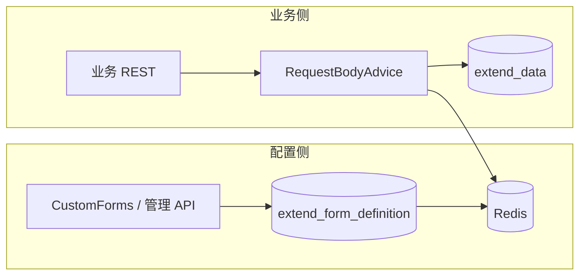

# 动态字段（扩展字段）使用方案

> 适用版本：7.3.x | 模块：`jbm-framework-autoconfigure-extendfield`、Center `jbm-cluster-platform-center`

本文说明 JBM7 **动态字段**：字段定义在线配置，业务值存 MySQL `extend_data`，元数据缓存在 Redis（租户 + `formCode`）。接口 URL 不变，请求带 `formCode` 与平铺扩展键即可。

---

## 1. 核心概念

| 概念 | 说明 |
|------|------|
| **formCode** | 场景编码，区分同一接口下的字段集合 |
| **字段定义** | `FieldDefinition`（fieldName、fieldType、fieldLabel） |
| **extend_data** | `MasterDataEntity.extendData`，表 JSON 列 |
| **配置真源** | Center 表 `extend_form_definition` |
| **Redis 键** | `extend_field:form:{tenantId}:{formCode}` |

- **配置侧**：入库并发布 Redis（Center `/extend-field/forms` 或 CustomForms）。
- **业务侧**：`@EnableExtendField(source = REDIS)`，只读 Redis，不改定义。

---

## 2. 架构



---

## 3. 请求与响应

### 3.1 写入

Body 含 **formCode**，扩展字段与固定字段**平铺**；Advice 按 Redis 定义写入 **extendData**。

```json
{
  "formCode": "sales_form",
  "orderNo": "ORD-001",
  "contactPhone": "13800001111",
  "region": "华东"
}
```

### 3.2 查询

**extend** 对象会映射为 **extendQuery**（`@TableField(exist = false)`），供动态 SQL 使用。

### 3.3 响应

`jbm.extend-field.auto-flatten=true`（默认）时，**extendData** 平铺到响应同级。

---

## 4. 实体与表

1. 实体继承 `MasterDataEntity`，`@TableName(autoResultMap = true)`。
2. 业务表增加 `extend_data`（Liquibase）。
3. Center：`V5__extend_form_definition`、`V6__custom_forms_and_extend_data`。

ORM 约定见 [masterdata-orm-7.3.md](masterdata-orm-7.3.md)。

---

## 5. 配置

```yaml
jbm:
  extend-field:
    enabled: true
    source: REDIS
    auto-flatten: true
    sync-local-to-redis-on-startup: false
    builtin-definition-controller-enabled: false   # Center 建议 false
    tenant:
      enabled: true
      header: tenantId
      default-tenant-id: "0"
      use-default-when-missing: true
```

Profile 示例：`bootstrap-jaja7.yml`、`bootstrap-h2.yml`。

---

## 6. 使用场景

### 6.1 Center（配置 + 消费，推荐）

| 步骤 | 操作 |
|------|------|
| 启动 | `@EnableExtendField(source = FieldDefinitionSource.REDIS)` |
| 发布定义 | `POST /extend-field/forms/{formCode}` 或 `POST /customForms/saveData`（`code`=formCode） |
| 业务调用 | Body：`formCode` + 平铺扩展字段 |
| 租户 | Header/参数 `tenantId` → 登录 `appId` → 默认 `0` |

Center 专项：[EXTEND_FIELD_INTEGRATION.md](../jbm-cluster/jbm-cluster-platform/jbm-cluster-platform-center/docs/EXTEND_FIELD_INTEGRATION.md)

### 6.2 其它微服务

```xml
<dependency>
  <groupId>com.jbm</groupId>
  <artifactId>jbm-framework-autoconfigure-extendfield</artifactId>
</dependency>
<dependency>
  <groupId>com.jbm</groupId>
  <artifactId>jbm-framework-autoconfigure-redis</artifactId>
</dependency>
```

- 启动：`@EnableExtendField(source = REDIS)`
- 改定义：Feign `ExtendFormDefinitionClient` → Center
- 运行时：只读 Redis

### 6.3 多租户

同一 **formCode**、不同 **tenantId** 互不影响；无租户头且 `use-default-when-missing: true` 时使用租户 **0**。

### 6.4 本地双服务示例

[jbm-examples/EXTEND_FIELD_DUAL_SERVICES.md](../jbm-examples/EXTEND_FIELD_DUAL_SERVICES.md)（设计器 18081 / 业务 18082）。

---

## 7. Center 管理 API

| 方法 | 路径 | 说明 |
|------|------|------|
| POST | `/extend-field/forms/{formCode}` | 保存并发布 |
| PUT | `/extend-field/forms/{formCode}` | 更新并发布 |
| POST | `/extend-field/forms/{formCode}/publish` | 从库刷新 Redis |
| GET | `/extend-field/forms/{formCode}` | 读库 |
| GET | `/extend-field/forms/{formCode}/definitions` | 读 Redis |

**CustomForms**：`code` 即 `formCode`；`autoPublishExtendField` 默认 `true`。

---

## 8. 实施顺序

1. 业务表加 `extend_data`，Center 执行 Liquibase V5/V6  
2. 各服务配置 `jbm.extend-field`  
3. 发布表单定义，检查 Redis 键  
4. 业务联调（formCode + 平铺字段）  
5. 在线加字段后重新发布（业务无需重启）  
6. Redis 丢失：`POST .../publish` 从库恢复  

---

## 9. 常见问题

| 现象 | 处理 |
|------|------|
| 未写入 extend_data | `enabled`、Redis 定义、`formCode`、租户是否一致 |
| 响应未平铺 | `auto-flatten`、`ResultBody` + `ResultExtendAop` |
| 发布失败 | 引入 redis 模块且 Redis 可连 |
| API 路径冲突 | `builtin-definition-controller-enabled: false` |

---

## 10. 相关文档

| 文档 | 说明 |
|------|------|
| [Center 接入](../jbm-cluster/jbm-cluster-platform/jbm-cluster-platform-center/docs/EXTEND_FIELD_INTEGRATION.md) | Center 依赖与 Feign |
| [双服务示例](../jbm-examples/EXTEND_FIELD_DUAL_SERVICES.md) | 本地 curl / IT |
| [Masterdata ORM](masterdata-orm-7.3.md) | Liquibase 与 extend_data |
