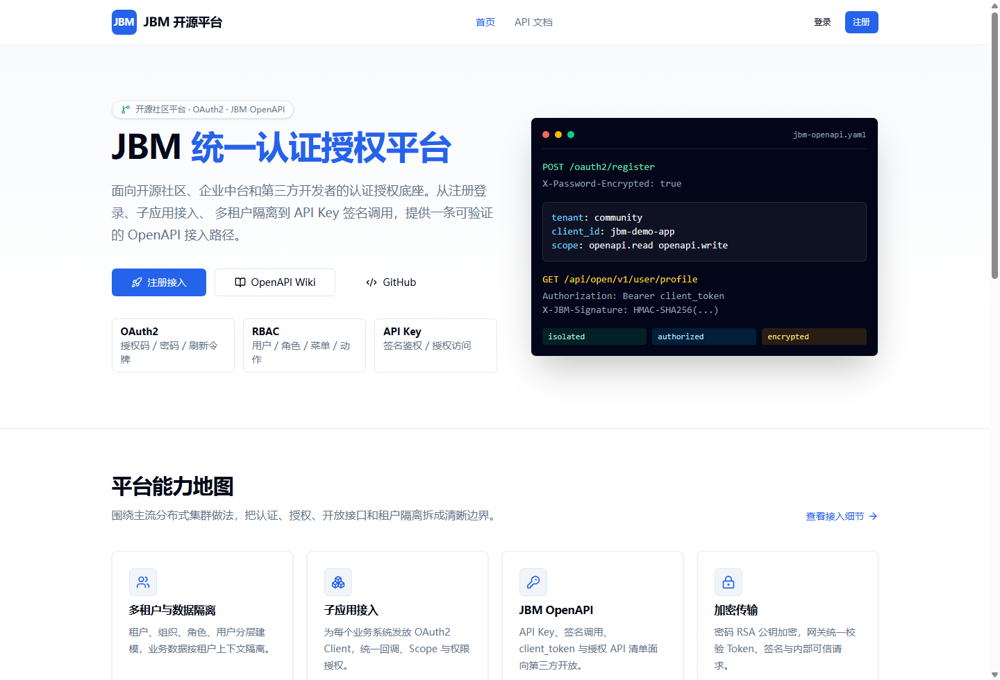
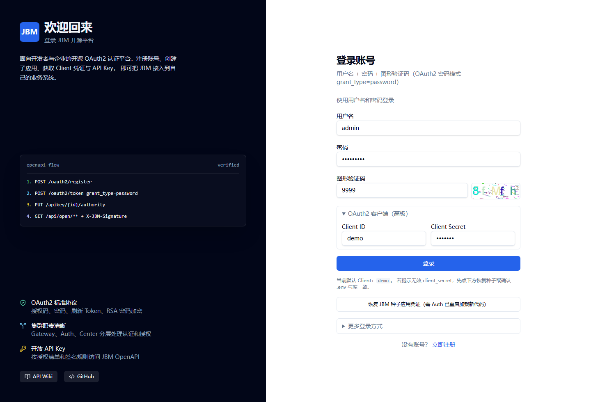
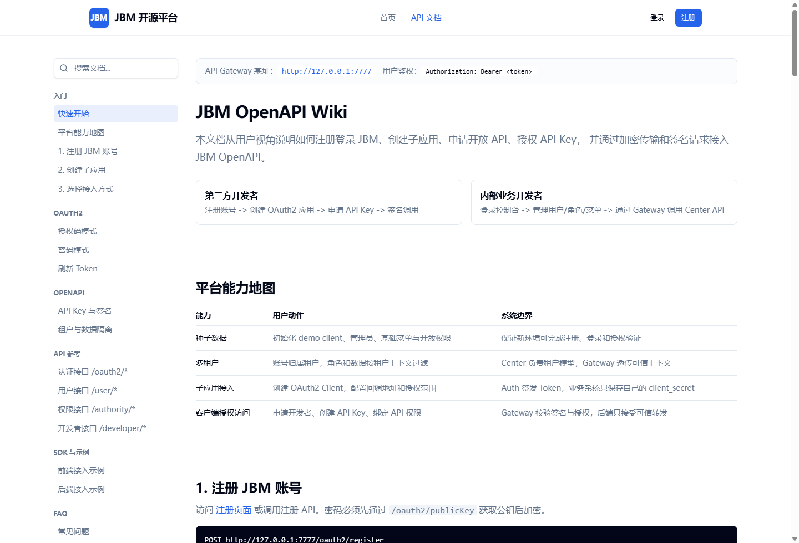

# jbm-admin-vue

JBM7 管理后台与开放平台前端，基于 Vue 3 + Vite + TypeScript + Pinia + Tailwind CSS。当前前端包含管理控制台、开源社区首页、注册登录、JBM OpenAPI Wiki 和 API Key 接入说明。

## 7.3 包结构

本仓库只提供基础技术平台，不包含 IoT、建筑等行业业务。下游按需安装公共包，并以模块形式扩展行业页面：

| 包 | 职责 |
| --- | --- |
| `@jbm7/sdk` | 无框架请求、Token/租户适配、刷新与 PKCE |
| `@jbm7/vue-core` | Vue 插件、模块契约、路由与权限守卫 |
| `@jbm7/admin` | 基础平台管理模块与标准管理壳 |
| `jbm-admin-host` | 本仓库开发、集成和验收宿主，不发布 |

所有可发布包均为 ESM，通过 `@jbm7/*` 子路径按需引用。后端仍可采用分布式服务架构，前端只面向稳定的 Gateway/API 契约，不感知服务发现和内部部署拓扑。

私有仓库认证只通过本机或 CI 环境变量 `JBM_NPM_AUTH` 注入；仓库中不保存账号密码。浏览器 OAuth 使用授权码 + PKCE，不配置客户端密钥。

## 页面预览







## 新增能力

- 公开首页：面向开源社区和第三方开发者展示 JBM 平台能力。
- 注册页：支持账号注册、验证码、RSA 加密密码提交。
- 登录页：支持 OAuth2 密码模式，默认接入 Gateway。
- OpenAPI Wiki：从用户视角说明注册登录、子应用接入、API Key、签名调用和租户隔离。
- 开放平台导航：未登录用户可访问首页、注册、登录和 API 文档。
- 管理控制台：登录后进入用户、角色、菜单、应用、开发者、API Key 等模块。

## 前置服务

前端只访问 Gateway，不直接访问 Auth 或 Center。开发环境使用 `dev` profile，生产环境使用 `prod`。

| 服务 | 端口 | 说明 |
| --- | --- | --- |
| Gateway | `6060` | 前端统一 API 入口 |
| Auth | `5555` | OAuth2、注册、登录、验证码 |
| Center | `7777` | 用户、权限、应用、API Key |
| Vue | `5173` | 前端开发服务 |

启动后端：

```powershell
cd ..
python scripts\jbm_cluster_ops.py restart
python scripts\jbm_cluster_ops.py status
```

## 本地开发

```bash
npm install --registry https://registry.npmjs.org
npm run dev -- --host 127.0.0.1 --port 5173
```

访问：

- 首页：<http://127.0.0.1:5173/>
- 登录：<http://127.0.0.1:5173/login>
- 注册：<http://127.0.0.1:5173/register>
- OpenAPI Wiki：<http://127.0.0.1:5173/docs>
- 管理控制台：<http://127.0.0.1:5173/dashboard>

## 默认登录

| 项 | 值 |
| --- | --- |
| 用户名 | `admin` |
| 密码 | `Admin@123` |
| Client ID | `demo` |
| Client Secret | 仅服务端保密客户端使用，浏览器端不配置 |
| 开发验证码 | `9999` |

## 构建

```bash
npm run build
```

## API 代理

`vite.config.ts` 将前端 API 请求代理到 Gateway：

```text
http://127.0.0.1:6060
```

登录、注册、验证码、用户、权限、应用和 API Key 都经由 Gateway 访问。

## 验证记录

本轮已通过：

- `npm run build`
- 浏览器打开 `/`、`/login`、`/register`、`/docs`
- 默认 admin 登录并跳转 `/dashboard`
- 后端 `run_all_rest_tests.py`
- API Key / OpenAPI 接入链路 `run_api_key_flow_tests.py`

详细记录见 [验证总结](../.cursor/jbm-verification-summary.md)。
