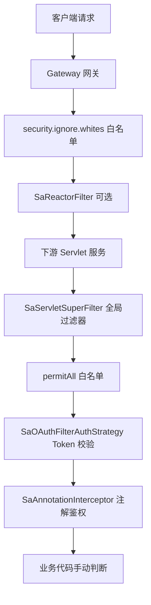

# JBM 接口访问约束方式说明

本文档整理 JBM 7.2 中**接口级访问控制**的几种实现方式、生效层级、配置入口与使用建议。

---

## 一、整体分层

请求从外到内依次经过多层约束，**并非每一层都做权限校验**：



| 层级 | 主要作用 | 是否校验「角色/权限码」 |
|------|----------|-------------------------|
| Gateway 白名单 | 部分路径跳过网关过滤器 | 否 |
| Gateway `SaAuthFilter` | 预留登录校验（当前未启用 `checkLogin`） | 否 |
| `SaServletSuperFilter` | **Token 是否有效**（登录态） | 否 |
| `@SaCheckLogin` | 方法级登录校验 | 否 |
| `@SaCheckPermission` | 方法级**权限码**校验 | 是（权限码） |
| `@SaCheckRole` | 方法级**角色**校验 | 是（角色码，项目内未使用） |
| 业务代码 `LoginHelper.isAdmin()` 等 | 数据范围 / 超管判断 | 是（用户 ID） |

---

## 二、Sa-Token 注解（推荐、当前主力）

由 `JbmSecurityConfiguration` 注册 `SaAnnotationInterceptor`，在 Controller 方法执行前拦截。

**配置类**：[`JbmSecurityConfiguration.java`](../jbm-cluster-common/jbm-cluster-common-security/src/main/java/com/jbm/cluster/common/security/configuration/JbmSecurityConfiguration.java)

### 2.1 `@SaCheckLogin` — 仅要求已登录

```java
@SaCheckLogin
@GetMapping("/current/info")
public ResultBody<?> getInfo() { ... }
```

- 校验：当前请求是否持有有效 Token（已登录）
- **不校验**具体角色或权限码
- 项目内使用较多：`CurrentUserController`、`BaseUserConfigController`、`PushMessageController`、`OAuth2ServerController` 等

### 2.2 `@SaCheckPermission` — 校验权限码

```java
@SaCheckPermission("ACTION_monitor:online:forceLogout")
@PostMapping("/forceLogout")
public ResultBody<?> forceLogout(...) { ... }
```

- 校验：当前用户 `menuPermission` 集合中是否包含指定权限码
- 权限数据来源见 [第五节](#五角色与权限的数据来源)
- 支持多值、AND/OR（Sa-Token 原生能力）
- 示例：[`OnlineUserController.java`](../jbm-cluster-platform/jbm-cluster-platform-auth/src/main/java/com/jbm/cluster/auth/controller/OnlineUserController.java)

**权限码命名约定**（[`JbmSecurityConstants`](../jbm-cluster-core/src/main/java/com/jbm/cluster/core/constant/JbmSecurityConstants.java)）：

| 前缀 | 含义 | 示例 |
|------|------|------|
| `MENU_` | 菜单 | `MENU_system:user` |
| `ROLE_` | 角色（权限体系内） | `ROLE_admin` |
| `API_` | 接口 | `API_center:user:list` |
| `ACTION_` | 按钮/操作 | `ACTION_monitor:online:logout` |

### 2.3 `@SaCheckRole` — 校验角色码

```java
@SaCheckRole("admin")
@PostMapping("/xxx")
public ResultBody<?> xxx() { ... }
```

- 校验：当前用户 `roles` 集合中是否包含指定角色码（`BaseRole.roleCode`）
- **当前代码库中未发现 `@SaCheckRole` 的实际使用**
- 若需按角色约束接口，可使用本注解，或改用 `@SaCheckPermission` + 角色对应权限码

### 2.4 注解与 `StpInterface` 的对应关系

[`SaPermissionImpl`](../jbm-cluster-common/jbm-cluster-common-satoken/src/main/java/com/jbm/cluster/common/satoken/core/service/SaPermissionImpl.java) 实现 Sa-Token 的 `StpInterface`：

| 注解 | 调用的接口方法 | 读取的字段 |
|------|----------------|------------|
| `@SaCheckPermission` | `getPermissionList(loginId, loginType)` | `JbmLoginUser.menuPermission` |
| `@SaCheckRole` | `getRoleList(loginId, loginType)` | `JbmLoginUser.roles` |

注册位置：[`SaTokenConfiguration.saPermissionImpl()`](../jbm-cluster-common/jbm-cluster-common-satoken/src/main/java/com/jbm/cluster/common/satoken/config/SaTokenConfiguration.java)

---

## 三、全局 Servlet 过滤器 — Token 登录态校验

**不是**角色/权限校验，而是校验「请求是否携带有效 Token」。

| 组件 | 说明 |
|------|------|
| `SaServletSuperFilter` | 增强版 Sa 全局 Filter，统一 JSON 错误响应 |
| `SaOAuthFilterAuthStrategy` | 实际认证策略 |

**认证通过路径**（[`SaOAuthFilterAuthStrategy`](../jbm-cluster-common/jbm-cluster-common-satoken/src/main/java/com/jbm/cluster/common/satoken/core/filter/SaOAuthFilterAuthStrategy.java)）：

1. 本机回环 IP（`127.x.x.x` / `::1`）→ 直接放行
2. `StpUtil` 用户 Token 有效 → 放行
3. 请求头带 `Satoken-Id-Token` 且校验通过 → 服务间互信放行
4. OAuth2 `AccessToken` / `ClientToken` 有效 → 放行
5. 否则 → 抛出「无效 Token」等异常

**白名单（跳过上述 Filter）**：

- 固定：`/actuator/**`、`/v2/api-docs/**`
- 配置：`jbm.cluster.permit-all`（各服务 `bootstrap.yml`）
- 注解：扫描带 `@PermitAll` 的接口路径自动加入白名单

---

## 四、项目自定义注解（`jbm-cluster-common-security`）

定义在 [`com.jbm.cluster.common.security.annotation`](../jbm-cluster-common/jbm-cluster-common-security/src/main/java/com/jbm/cluster/common/security/annotation/) 包下。

| 注解 | 设计用途 | 当前是否生效 |
|------|----------|--------------|
| `@PermitAll` | 标记接口无需 Token | **是** — 自动加入 `SaServletSuperFilter` 白名单 |
| `@RequiresLogin` | 要求登录 | **否** — 无对应拦截器 |
| `@RequiresPermissions` | 要求权限码（支持 AND/OR） | **否** — 无对应拦截器 |
| `@RequiresRoles` | 要求角色（支持 AND/OR） | **否** — 无对应拦截器 |
| `@InnerAuth` | 内部服务调用认证 | **否** — 代码库中无使用与拦截实现 |

> **注意**：`jbm-cluster-platform-job` 中使用的 `@RequiresPermissions` 目前**不会触发任何拦截**，如需权限控制应改为 `@SaCheckPermission` 或在业务层手动校验。

`@PermitAll` 使用示例：

```java
@PermitAll
@GetMapping("/health")
public ResultBody<String> health() { ... }
```

---

## 五、角色与权限的数据来源

登录成功后，用户角色与权限写入 `JbmLoginUser` 并存入 Token Session（Redis）。

**组装逻辑**（[`LoginAuthenticateHelper`](../jbm-cluster-platform/jbm-cluster-platform-center/src/main/java/com/jbm/cluster/center/controller/authenticate/LoginAuthenticateHelper.java)）：

```java
// 角色：BaseRole.roleCode
jbmLoginUser.setRoles(roles);

// 权限：OpenAuthority.authority（菜单/接口/操作等统一权限码）
jbmLoginUser.setMenuPermission(menuPermission);
```

**`JbmLoginUser` 相关字段**：

| 字段 | 含义 | 用于 |
|------|------|------|
| `roles` | 角色编码集合 | `@SaCheckRole`、`getRoleList` |
| `menuPermission` | 权限码集合 | `@SaCheckPermission`、`getPermissionList` |
| `roleIds` | 角色 ID 集合 | 业务查询、数据权限 |
| `rolePermission` | 预留字段 | 当前登录流程未赋值 |

---

## 六、业务代码手动约束

不依赖注解，在 Controller / Service 中直接判断，常用于**数据范围**而非接口路由。

### 6.1 超级管理员判断

```java
if (!LoginHelper.isAdmin()) {
    throw new ServiceException("无权限操作，仅超级管理员可操作");
}
```

- 实现：[`LoginHelper.isAdmin()`](../jbm-cluster-common/jbm-cluster-common-satoken/src/main/java/com/jbm/cluster/common/satoken/utils/LoginHelper.java)
- 规则：`userId == 0`（[`UserConstants.ADMIN_ID`](../jbm-cluster-core/src/main/java/com/jbm/cluster/core/constant/UserConstants.java)）
- 示例：[`SystemDebugController`](../jbm-cluster-platform/jbm-cluster-platform-center/src/main/java/com/jbm/cluster/center/controller/SystemDebugController.java)

### 6.2 按登录用户过滤数据

```java
if (ObjectUtil.isEmpty(LoginHelper.softGetLoginUser()) || LoginHelper.isAdmin()) {
    // 管理员：查全部
} else {
    // 普通用户：仅查自己的数据
    form.setUserId(LoginHelper.getUserId());
}
```

常见于 `BaseUserServiceImpl`、`BaseRoleServiceImpl`、`BaseOrgServiceImpl` 等。

### 6.3 获取当前用户

| 方法 | 说明 |
|------|------|
| `LoginHelper.getLoginUser()` | 获取登录用户，未登录抛异常 |
| `LoginHelper.softGetLoginUser()` | 安全获取，未登录返回 `null` |
| `LoginHelper.getUserId()` / `getUsername()` | 快捷取常用字段 |

---

## 七、配置级白名单

### 7.1 下游服务 — `jbm.cluster.permit-all`

```yaml
jbm:
  cluster:
    permit-all:
      - /oauth2/**
      - /captcha/**
```

- 作用：对应路径**跳过** `SaServletSuperFilter` 的 Token 校验
- 配置类：[`JbmClusterProperties`](../jbm-cluster-common/jbm-cluster-common-basic/src/main/java/com/jbm/cluster/common/basic/configuration/config/JbmClusterProperties.java)

### 7.2 Gateway — `security.ignore.whites`

```yaml
security:
  ignore:
    whites:
      - /code
      - /auth/**
      - /admin/**
```

- 作用：网关 `SaReactorFilter` 排除路径
- 配置类：[`IgnoreWhiteProperties`](../jbm-cluster-platform/jbm-cluster-platform-gateway/src/main/java/com/jbm/cluster/platform/gateway/config/properties/IgnoreWhiteProperties.java)

### 7.3 Gateway — `jbm.api`（网关 bootstrap.yml）

```yaml
jbm:
  api:
    access-control: true
    permit-all:
      - /*/login/**
      - /*/oauth/**
    authority-ignores:
      - /*/authority/granted/me
      - /*/current/user/**
```

- `permit-all` / `authority-ignores`：网关层放行规则（与下游 Filter 白名单配合使用）
- 动态 API 权限加载（`DynamicResourceLocator`）相关校验逻辑**大部分已注释**，当前不以网关动态权限为主拦截手段

---

## 八、Gateway 与其他过滤器

| 组件 | 作用 | 约束类型 |
|------|------|----------|
| `SaAuthFilter` | Gateway 全局 Sa 过滤器 | 当前仅 `match`，**未调用** `StpUtil.checkLogin()` |
| `ValidateCodeFilter` | 登录/注册验证码 | 验证码，非角色权限 |
| `TokenFilter` / `ApiFilter` | 访问日志 enrichment | 日志，非鉴权 |

Gateway **不负责**细粒度角色/权限鉴定，主要做路由与白名单；鉴权在下游服务完成。

---

## 九、方式对比与选用建议

| 需求 | 推荐方式 | 示例 |
|------|----------|------|
| 公开接口（健康检查、文档） | `@PermitAll` 或 `permit-all` 配置 | `DocHealthController` |
| 仅需登录 | `@SaCheckLogin` | `CurrentUserController` |
| 需特定操作权限 | `@SaCheckPermission("ACTION_xxx")` | `OnlineUserController` 强退 |
| 需特定角色 | `@SaCheckRole("roleCode")`（项目内暂无先例） | — |
| 仅超管可操作 | `LoginHelper.isAdmin()` | `SystemDebugController` |
| 数据按用户隔离 | Service 层 `LoginHelper.getUserId()` | 用户/组织列表查询 |
| 内部 Feign 调用 | Header `from-source: inner`（约定，需调用方配合） | `RemoteUserService` |

**不推荐**：

- 继续使用 `@RequiresPermissions` / `@RequiresRoles` / `@RequiresLogin`（无拦截器，不生效）
- 仅注释掉 `@SaCheckPermission` 而不加其他约束（如 `OnlineUserController.pageList` 第 48 行）—— 接口将只受全局 Token 过滤器保护，**任何已登录用户均可访问**

---

## 十、相关源码索引

| 主题 | 路径 |
|------|------|
| 安全配置入口 | `jbm-cluster-common-security/.../JbmSecurityConfiguration.java` |
| Token 过滤策略 | `jbm-cluster-common-satoken/.../SaOAuthFilterAuthStrategy.java` |
| 权限/角色提供者 | `jbm-cluster-common-satoken/.../SaPermissionImpl.java` |
| 登录用户工具 | `jbm-cluster-common-satoken/.../LoginHelper.java` |
| 权限常量前缀 | `jbm-cluster-core/.../JbmSecurityConstants.java` |
| 登录时权限装载 | `jbm-cluster-platform-center/.../LoginAuthenticateHelper.java` |
| Token 全链路文档 | `jbm-cluster-platform-auth/docs/token-auth-full-chain.md` |

---

## 十一、快速排查清单

接口「不该被访问却能访问」时，按顺序检查：

1. 是否配置了 `permit-all` / `@PermitAll` 放行？
2. 是否来自本机 IP，被 `SaOAuthFilterAuthStrategy` 直接放行？
3. 接口是否只有全局 Token 校验，**没有** `@SaCheckPermission`？
4. 是否误用 `@RequiresPermissions`（实际不生效）？
5. 业务层是否用 `softGetLoginUser()` 空值时默认放行？
6. 调试模式 `JBM_DEBUG=true` 是否影响了验证码等安全策略（与权限无关，但常见于安全测试）？
