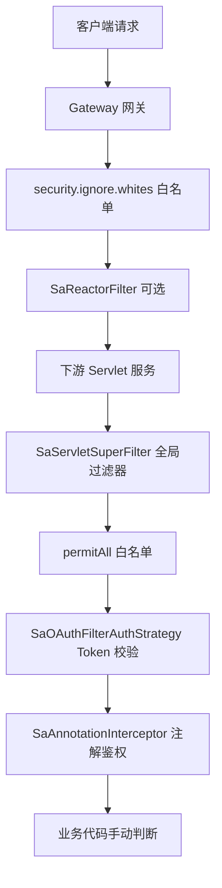

# JBM 接口访问约束方式说明

本文档整理 JBM 7.2 中**已接入且生效**的接口级访问控制方式、配置入口与项目内真实用法。

---

## 一、整体分层

请求从外到内依次经过多层约束，**并非每一层都做权限校验**：



| 层级 | 主要作用 | 是否校验「角色/权限码」 |
|------|----------|-------------------------|
| Gateway 白名单 | 部分路径跳过网关过滤器 | 否 |
| Gateway `SaAuthFilter` | 预留登录校验（当前未启用 `checkLogin`） | 否 |
| `SaServletSuperFilter` | **Token 是否有效**（登录态） | 否 |
| `@PermitAll` | 跳过 Token 过滤器 | 否 |
| `@SaCheckLogin` | 方法级登录校验 | 否 |
| `@SaCheckPermission` | 方法级**权限码**校验 | 是 |
| `@SaCheckRole` | 方法级**角色码**校验 | 是 |
| `LoginHelper.isAdmin()` 等 | 数据范围 / 超管判断 | 是（用户 ID） |

---

## 二、Sa-Token 注解（接口鉴权主力）

由 [`JbmSecurityConfiguration`](../jbm-cluster-common/jbm-cluster-common-security/src/main/java/com/jbm/cluster/common/security/configuration/JbmSecurityConfiguration.java) 注册 `SaAnnotationInterceptor`，在 Controller 方法执行前拦截。

权限/角色数据由 [`SaPermissionImpl`](../jbm-cluster-common/jbm-cluster-common-satoken/src/main/java/com/jbm/cluster/common/satoken/core/service/SaPermissionImpl.java) 提供，在 [`SaTokenConfiguration`](../jbm-cluster-common/jbm-cluster-common-satoken/src/main/java/com/jbm/cluster/common/satoken/config/SaTokenConfiguration.java) 中注册为 `StpInterface`。

| 注解 | 读取字段 | 数据来源 |
|------|----------|----------|
| `@SaCheckPermission` | `JbmLoginUser.menuPermission` | 登录时装载，见 [第五节](#五角色与权限的数据来源) |
| `@SaCheckRole` | `JbmLoginUser.roles` | 登录时装载，`BaseRole.roleCode` |

---

### 2.1 `@SaCheckLogin` — 仅要求已登录

**适用**：当前用户自己的资料、密码修改等，只需 Token 有效，不校验具体权限码。

**项目案例** — [`CurrentUserController`](../jbm-cluster-platform/jbm-cluster-platform-center/src/main/java/com/jbm/cluster/center/controller/CurrentUserController.java)：

```java
@SaCheckLogin
@ApiOperation(value = "修改当前登录用户密码", notes = "修改当前登录用户密码")
@GetMapping("/user/rest/password")
public ResultBody restPassword(@RequestParam(value = "password") String password) {
    baseUserService.updatePassword(SecurityUtils.getLoginUser().getUserId(), password);
    return ResultBody.ok();
}
```

**项目案例** — [`OAuth2ServerController`](../jbm-cluster-platform/jbm-cluster-platform-auth/src/main/java/com/jbm/cluster/auth/controller/OAuth2ServerController.java)：

```java
@SaCheckLogin
@RequestMapping("/userinfo")
public ResultBody<JbmLoginUser> userinfo() { ... }
```

---

### 2.2 `@SaCheckPermission` — 校验权限码

**适用**：按钮/操作级接口，用户 `menuPermission` 中须包含指定权限码（与菜单 `authority` 字段一致）。

**权限码前缀**（[`JbmSecurityConstants`](../jbm-cluster-core/src/main/java/com/jbm/cluster/core/constant/JbmSecurityConstants.java)）：

| 前缀 | 含义 | 示例 |
|------|------|------|
| `MENU_` | 菜单 | `MENU_onlineUsers` |
| `ROLE_` | 角色（权限体系内） | `ROLE_admin` |
| `API_` | 接口 | `API_center:user:list` |
| `ACTION_` | 按钮/操作 | `ACTION_monitor:online:forceLogout` |

**项目案例** — 在线用户 [`OnlineUserController`](../jbm-cluster-platform/jbm-cluster-platform-auth/src/main/java/com/jbm/cluster/auth/controller/OnlineUserController.java)：

```java
@ApiOperation("在线用户列表")
@SaCheckPermission("ACTION_monitor:online:list")
@PostMapping("/pageList")
public ResultBody<DataPaging<SysUserOnline>> pageList(@RequestBody OnlineUserSearchForm form) { ... }

@ApiOperation("踢出用户")
@SaCheckPermission("ACTION_monitor:online:forceLogout")
@DeleteMapping("/kickout/{tokenId}")
public ResultBody<Void> forceLogout(@PathVariable String tokenId) { ... }

@ApiOperation("注销用户")
@SaCheckPermission("ACTION_monitor:online:logout")
@DeleteMapping("/logout/{tokenId}")
public ResultBody<Void> logout(@PathVariable String tokenId) { ... }
```

**项目案例** — 定时任务 [`SysJobController`](../jbm-cluster-platform/jbm-cluster-platform-job/src/main/java/com/jbm/cluster/job/controller/SysJobController.java)：

```java
@SaCheckPermission("ACTION_monitor:job:add")
@PostMapping("/add")
public ResultBody add(@RequestBody SysJob job) { ... }

@SaCheckPermission("ACTION_monitor:job:edit")
@PostMapping("/edit")
public ResultBody edit(@RequestBody SysJob job) { ... }

@SaCheckPermission("ACTION_monitor:job:changeStatus")
@PutMapping("/changeStatus")
public ResultBody changeStatus(@RequestBody SysJob job) { ... }
```

**多权限（Sa-Token 原生）**：同一接口要求多个权限码时，使用 `value` + `mode`：

```java
import cn.dev33.satoken.annotation.SaMode;

// 默认 AND：须同时拥有两个权限
@SaCheckPermission(value = {"ACTION_a", "ACTION_b"}, mode = SaMode.AND)

// OR：拥有其一即可
@SaCheckPermission(value = {"ACTION_a", "ACTION_b"}, mode = SaMode.OR)
```

---

### 2.3 `@SaCheckRole` — 校验角色码

**适用**：按 `BaseRole.roleCode` 约束接口；用户登录后 `roles` 为**集合**，可拥有多个角色。

**项目案例** — [`OnlineUserController`](../jbm-cluster-platform/jbm-cluster-platform-auth/src/main/java/com/jbm/cluster/auth/controller/OnlineUserController.java)：

```java
@ApiOperation("刷新Token临时有效期")
@SaCheckRole("admin")
@DeleteMapping("/refresh")
public ResultBody<Void> refresh() {
    return ResultBody.callback("刷新成功", () -> {
        StpUtil.updateLastActivityToNow();
        return null;
    });
}
```

**多角色（Sa-Token 原生）**：

```java
import cn.dev33.satoken.annotation.SaMode;

// 默认 AND：须同时拥有 admin 和 manager
@SaCheckRole(value = {"admin", "manager"}, mode = SaMode.AND)

// OR：拥有 admin 或 manager 任一即可
@SaCheckRole(value = {"admin", "manager"}, mode = SaMode.OR)
```

> 角色码填 `BaseRole.roleCode`（如 `admin`），**不是**角色 ID，也**不是** `ROLE_` 前缀的权限码。

---

## 三、全局 Servlet 过滤器 — Token 登录态校验

**作用**：校验「请求是否携带有效 Token」，**不做**细粒度权限/角色校验。

| 组件 | 说明 |
|------|------|
| `SaServletSuperFilter` | 增强版 Sa 全局 Filter，统一 JSON 错误响应 |
| `SaOAuthFilterAuthStrategy` | 实际认证策略 |

**认证通过路径**（[`SaOAuthFilterAuthStrategy`](../jbm-cluster-common/jbm-cluster-common-satoken/src/main/java/com/jbm/cluster/common/satoken/core/filter/SaOAuthFilterAuthStrategy.java)）：

1. 本机回环 IP（`127.x.x.x` / `::1`）→ 直接放行
2. `StpUtil` 用户 Token 有效 → 放行
3. 请求头带 `Satoken-Id-Token` 且校验通过 → 服务间互信放行
4. OAuth2 `AccessToken` / `ClientToken` 有效 → 放行
5. 否则 → 抛出「无效 Token」等异常

**白名单（跳过上述 Filter）**：

- 固定：`/actuator/**`、`/v2/api-docs/**`
- 配置：`jbm.cluster.permit-all`（各服务 `bootstrap.yml`）
- 注解：扫描带 `@PermitAll` 的接口路径自动加入白名单

**项目案例** — [`DocHealthController`](../jbm-cluster-platform/jbm-cluster-platform-doc/src/main/java/com/jbm/cluster/doc/controller/DocHealthController.java)：

```java
@PermitAll
@ApiOperation(value = "文件服务就绪探针")
@GetMapping("/file")
public ResponseEntity<Map<String, Object>> fileHealth() { ... }
```

---

## 四、角色与权限的数据来源

登录成功后，用户角色与权限写入 `JbmLoginUser` 并存入 Token Session（Redis）。

**组装逻辑**（[`LoginAuthenticateHelper`](../jbm-cluster-platform/jbm-cluster-platform-center/src/main/java/com/jbm/cluster/center/controller/authenticate/LoginAuthenticateHelper.java)）：

```java
// 角色：BaseRole.roleCode，一个用户可有多个
jbmLoginUser.setRoles(roles);

// 权限：OpenAuthority.authority（菜单/接口/操作等统一权限码）
jbmLoginUser.setMenuPermission(menuPermission);
```

**`JbmLoginUser` 相关字段**：

| 字段 | 含义 | 用于 |
|------|------|------|
| `roles` | 角色编码集合 | `@SaCheckRole` |
| `menuPermission` | 权限码集合 | `@SaCheckPermission` |
| `roleIds` | 角色 ID 集合 | 业务查询、数据权限 |

菜单/按钮权限初始化参考 [`menu.json`](../jbm-cluster-platform/jbm-cluster-platform-center/src/test/resources/menu.json)（如在线用户 `ACTION_monitor:online:*`）。

---

## 五、业务代码手动约束

不依赖注解，在 Controller / Service 中直接判断，常用于**数据范围**而非接口路由。

### 5.1 超级管理员判断

```java
if (!LoginHelper.isAdmin()) {
    throw new ServiceException("无权限操作，仅超级管理员可操作");
}
```

- 规则：`userId == 0`（[`UserConstants.ADMIN_ID`](../jbm-cluster-core/src/main/java/com/jbm/cluster/core/constant/UserConstants.java)）
- 案例：[`SystemDebugController`](../jbm-cluster-platform/jbm-cluster-platform-center/src/main/java/com/jbm/cluster/center/controller/SystemDebugController.java)

### 5.2 按登录用户过滤数据

```java
if (ObjectUtil.isEmpty(LoginHelper.softGetLoginUser()) || LoginHelper.isAdmin()) {
    // 管理员：查全部
} else {
    form.setUserId(LoginHelper.getUserId());
}
```

常见于 `BaseUserServiceImpl`、`BaseRoleServiceImpl`、`BaseOrgServiceImpl` 等。

### 5.3 获取当前用户

| 方法 | 说明 |
|------|------|
| `LoginHelper.getLoginUser()` | 获取登录用户，未登录抛异常 |
| `LoginHelper.softGetLoginUser()` | 安全获取，未登录返回 `null` |
| `LoginHelper.getUserId()` / `getUsername()` | 快捷取常用字段 |

---

## 六、配置级白名单

### 6.1 下游服务 — `jbm.cluster.permit-all`

```yaml
jbm:
  cluster:
    permit-all:
      - /oauth2/**
      - /captcha/**
```

- 作用：对应路径**跳过** `SaServletSuperFilter` 的 Token 校验
- 配置类：[`JbmClusterProperties`](../jbm-cluster-common/jbm-cluster-common-basic/src/main/java/com/jbm/cluster/common/basic/configuration/config/JbmClusterProperties.java)

### 6.2 Gateway — `security.ignore.whites`

```yaml
security:
  ignore:
    whites:
      - /code
      - /auth/**
      - /admin/**
```

- 作用：网关 `SaReactorFilter` 排除路径
- 配置类：[`IgnoreWhiteProperties`](../jbm-cluster-platform/jbm-cluster-platform-gateway/src/main/java/com/jbm/cluster/platform/gateway/config/properties/IgnoreWhiteProperties.java)

Gateway **不负责**细粒度角色/权限鉴定，主要做路由与白名单；鉴权在下游服务完成。

---

## 七、选用建议

| 需求 | 推荐方式 | 项目案例 |
|------|----------|----------|
| 公开接口（健康检查） | `@PermitAll` | `DocHealthController` |
| 公开接口（批量路径） | `jbm.cluster.permit-all` 配置 | 各服务 `bootstrap.yml` |
| 仅需登录 | `@SaCheckLogin` | `CurrentUserController`、`OAuth2ServerController` |
| 需特定操作权限 | `@SaCheckPermission("ACTION_xxx")` | `OnlineUserController`、`SysJobController` |
| 需特定角色 | `@SaCheckRole("roleCode")` | `OnlineUserController` `/refresh` |
| 仅超管可操作 | `LoginHelper.isAdmin()` | `SystemDebugController` |
| 数据按用户隔离 | Service 层 `LoginHelper.getUserId()` | 用户/组织列表查询 |

**注意**：

- 接口若仅有全局 Token 校验、无 `@SaCheckPermission` / `@SaCheckRole`，则**任意已登录用户**均可访问。
- OAuth2 `AccessToken` 可通过 Filter，但 `@SaCheckPermission` / `@SaCheckRole` 依赖 `StpUtil` 登录上下文；纯 Bearer 且未建立 Stp 会话时，注解鉴权会报未登录而非无权限。

---

## 八、相关源码索引

| 主题 | 路径 |
|------|------|
| 安全配置入口 | `jbm-cluster-common-security/.../JbmSecurityConfiguration.java` |
| Token 过滤策略 | `jbm-cluster-common-satoken/.../SaOAuthFilterAuthStrategy.java` |
| 权限/角色提供者 | `jbm-cluster-common-satoken/.../SaPermissionImpl.java` |
| 登录用户工具 | `jbm-cluster-common-satoken/.../LoginHelper.java` |
| 权限常量前缀 | `jbm-cluster-core/.../JbmSecurityConstants.java` |
| 登录时权限装载 | `jbm-cluster-platform-center/.../LoginAuthenticateHelper.java` |
| 注解鉴权单元测试 | `jbm-cluster-platform-auth/.../SaPermissionImplTest.java` |
| Token 全链路文档 | `jbm-cluster-platform-auth/docs/token-auth-full-chain.md` |

---

## 九、快速排查清单

接口「不该被访问却能访问」时，按顺序检查：

1. 是否配置了 `permit-all` / `@PermitAll` 放行？
2. 是否来自本机 IP，被 `SaOAuthFilterAuthStrategy` 直接放行？
3. 接口是否只有全局 Token 校验，**没有** `@SaCheckPermission` / `@SaCheckRole`？
4. 权限码是否与菜单 `authority` 一致（含 `ACTION_` 前缀）？
5. 业务层是否用 `softGetLoginUser()` 空值时默认放行？
