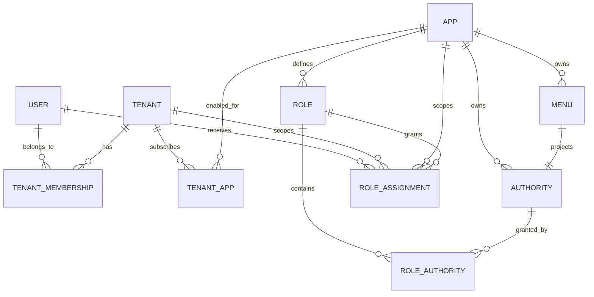

# JBM 统一租户与多应用权限设计规范

状态：实施基线
版本：1.2
日期：2026-08-11
适用范围：JBM 7.3 Python、IoT 平台及后续建筑等下游应用

## 1. 结论

JBM 是统一控制面（Control Plane）和唯一租户主数据源；IoT、建筑等应用是相互独立的数据面（Data Plane）。数据库是否独立不影响租户统一：所有系统使用 JBM 分配的同一个 `tenantId`、`userId` 和 `appId`，下游应用不得自行创建另一套租户身份。

一次有效授权上下文固定为：

```text
subject = userId + tenantId + appId
permission = subject 在该 tenantId、appId 下被授予角色后得到的权限集合
```

菜单只是权限的前端投影。后端 API 必须独立校验 `tenantId`、令牌受众和权限，不能以“菜单不可见”代替安全隔离。

## 2. 成熟模式与标准依据

本规范不是自创一套协议，而是组合使用以下成熟模式：

1. **SaaS 控制面 / 数据面分离**：租户目录、入驻、授权和生命周期属于控制面，租户业务数据属于数据面。Azure 的多租户架构指南将 tenant catalog 和 tenant lifecycle 作为控制面的核心职责，并建议控制面与租户工作负载隔离。[Microsoft：多租户控制面](https://learn.microsoft.com/en-us/azure/architecture/guide/multitenant/considerations/control-planes)
2. **Organization 作为 B2B 租户边界**：一个统一身份域中管理组织、成员和组织上下文，并把组织声明传给应用。Keycloak Organizations 采用同一模式。[Keycloak：Managing organizations](https://www.keycloak.org/docs/latest/server_admin/#_managing_organizations)
3. **OAuth 2.0 / OpenID Connect 应用边界**：每个前端客户端独立注册 `client_id` 和回调地址；每个资源服务校验自己的受众。OAuth 2.0 Resource Indicators 规定了目标资源和 audience restriction。[RFC 8707](https://www.rfc-editor.org/rfc/rfc8707.html)
4. **JWT 访问令牌校验**：资源服务必须校验签名、有效期和 `aud`，不能把发给其他应用的令牌直接复用。[RFC 9068](https://www.rfc-editor.org/rfc/rfc9068.html)
5. **租户隔离独立于普通认证授权**：用户已登录且拥有功能权限，不代表已经实现租户数据隔离；每次资源访问还必须限定当前租户。AWS SaaS 指南明确区分 tenant isolation 与 authentication/authorization。[AWS：Tenant isolation](https://docs.aws.amazon.com/whitepapers/latest/saas-architecture-fundamentals/tenant-isolation.html)
6. **跨域用户/组同步预留 SCIM**：未来对接企业目录时使用 SCIM 2.0，不让每个业务应用发明用户同步协议。[RFC 7644](https://www.rfc-editor.org/rfc/rfc7644.html)

OAuth/OIDC 没有定义业务“租户”字段名，因此 `tenantId` 是 JBM 的平台声明；但它的生成、选择、校验和传播必须遵循上述边界。

## 3. 领域模型



### 3.1 标识语义

| 标识 | 含义 | 生成方 | 是否跨库复用 |
|---|---|---|---|
| `tenantId` | 客户/组织租户的全局稳定 ID | JBM | 是，所有下游库原样保存 |
| `userId` | 人员账号的全局稳定 ID | JBM | 是 |
| `appId` | 应用/资源边界，如 IoT、建筑 | JBM | 是 |
| `roleId` | 某应用中的角色模板 | JBM | 下游通常只消费角色码/权限码 |
| `resourceId` | 下游业务实体 ID | 下游应用 | 否，由应用管理 |

`tenantId` 不能使用租户名称、域名、数据库主键的临时映射或 `appId` 代替。标识一经分配不可复用；注销使用状态字段和生命周期事件，不回收 ID。

### 3.2 应用与租户是多对多关系

`base_app.org_id` 只表示应用的所有者/开发组织，不表示只有该租户能使用应用。租户订阅应用必须是独立的多对多关系 `base_tenant_app(tenant_id, app_id, status, config, ...)`。

例如同一个租户可同时订阅 IoT 和建筑平台；同一个 IoT 应用也可服务多个租户。

### 3.3 用户与租户是多对多关系

`base_user.company_id` 保留为默认/主租户，用于兼容和默认登录上下文；`base_user_org` 是正式成员关系。一个用户未来可以属于多个租户，登录或切换租户时只能选择有效成员关系中的租户。

### 3.4 应用驱动的用户注册与普通租户入驻

用户侧统一称“用户注册”，不出现“创建租户账号”。注册成功后，控制面自动为用户建立普通租户上下文。是否开放注册、进入哪个应用、首个用户得到哪个普通租户角色，由应用配置决定。应用在 `base_app.extend_data.registration` 中声明 `enabled / mode=tenant / defaultRoleCode`；公开注册页面不得让注册人自行提交角色 ID 或角色码。

注册阶段只建立账号，不展示或接收“个人/组织”选择，也不要求组织名称。控制面自动生成 `org_type=account` 的技术隔离空间和稳定 `tenantId`；该空间不是个人认证结论，也不是企业组织。用户进入系统后，在独立的身份认证流程中才选择“个人认证”或“组织认证”，认证结果与账号注册事务解耦，参照主流云平台“先注册账号、后实名认证”的生命周期。

身份认证尚未完成时只能显示“未认证”，不得根据注册昵称、技术空间名称或客户端参数推断个人/组织。组织认证通过后再建立或绑定正式公司组织；个人认证通过后记录个人主体。认证资料、审核、第三方核验和敏感字段脱敏必须由后续身份认证模块完成，普通注册接口不得修改认证类型。

一次成功注册必须在同一数据库事务中完成：

```text
校验 clientId 的注册策略与验证码
  → 创建租户根组织（tenantId）
  → 创建首个用户和唯一登录凭证（userId/account）
  → 已验证手机号同时建立 base_account(account_type=mobile)
  → 创建正式成员关系 base_user_org
  → 开通 base_tenant_app(tenantId, appId)
  → 按应用配置绑定 owner role 到 base_role_user(tenantId, appId, userId, roleId)
```

任一步失败必须整体回滚，不能留下“有账号无租户”“有租户未开应用”或“客户端自选超级角色”的半成品。注册后首次登录仍使用应用自己的 OAuth client、回调域名和 IoT 原生视觉样式；JBM 提供统一认证与注册能力，不强迫下游应用使用 JBM 管理端外观。

短信认证入口由 JBM Auth 统一提供，IoT、建筑等应用只调用 `/captcha/pcode` 和 `/captcha/pcode/verify`，不得各自保存验证码或接入第二套短信账号。短信供应商、凭据、签名和模板统一归 JBM Push 管理并放在 Nacos 的 `push-{profile}.yml`；Auth 通过服务发现调用 Push 的 `/pin/send` 和 `/pin/check`。生产提供方采用阿里云号码认证服务 PNVS 官方 SDK：发送请求使用动态 `##code##` 占位符，校验请求只有在 API 返回成功且 `VerifyResult=PASS` 时才算验证码通过。

手机号既是用户资料也是可登录身份。注册或绑定成功时，`base_user.mobile` 与 `base_account(account_type=mobile)` 必须在同一事务写入；同一域内手机号只能绑定一个用户。短信登录先由提供方校验验证码，再按 mobile account 解析稳定 `userId`，最终仍签发同一套 JBM OAuth/OIDC 令牌，不创建应用侧用户。

生产环境必须使用真实验证码、防滥用、手机号/账号唯一性、协议确认和审计。图形码 `9999` 只由 Auth 的开发配置控制；短信码 `99999` 只由 Push 的 `verificationProvider=dev` 与 dry-run 配置控制。旁路仍必须校验手机号格式，生产 Push 启动时必须拒绝 dev/dry-run。

### 3.5 通用用户能力

消息中心、用户资料、头像裁剪、密码与账号安全属于 JBM 通用用户能力，由公共管理包统一提供，应用壳层只负责提供符合自身视觉体系的入口。下游应用不得复制消息存储、已读状态或头像裁剪实现；IoT 顶栏接入 JBM 未读数和消息中心路由，用户中心使用 JBM 头像上传与裁剪组件，页面名称不得暴露“JBM 用户中心”等底层包名。

列表的响应式行为也属于 JBM 通用组件规范。桌面端使用语义表格，手机端由公共 `Table` 组件统一转为业务卡片：优先以“名称/用户名/标题/账号”等字段作为卡片主标题，状态固定在标题区，默认最多展示四项非 ID 摘要，操作区与内容区分隔。应用可以声明 `mobileColumns` 调整摘要，但不得在业务页面复制一套表格转卡片逻辑；IoT 壳层只覆盖色彩、间距等主题变量，保留 IoT 视觉体系。

### 3.6 委托运营入口与账号授权

注册永远只授予普通租户默认角色，不允许在注册页选择“运营方”。平台运营管理员通过用户、角色页面主动授予账号 `iot_operator` 等应用功能角色，不采用“申请加入运营 → 平台审批”的资格流程。

客户租户管理员在“委托运营”页面输入运营方的精确账号，阅读并接受授权协议后直接建立限时、可撤销的账号级委托。控制面解析并固化 `operatorUserId + operatorTenantId`，同一运营租户内的其他账号不会继承该委托；被委托账号仍只能使用自身角色已有的功能权限。委托关系授予客户数据范围，不替代平台角色授权，也不把运营方变成客户租户成员。

## 4. 权限模型

采用带作用域的 RBAC：

- `base_role.app_id`：角色模板属于哪个应用；空值仅用于 JBM 平台级内置角色。
- `base_menu.app_id`、`base_authority.app_id`：菜单和权限属于哪个应用；空值仅用于平台公共能力。
- `base_role_user`：不是全局“用户有角色”，而是 `(tenant_id, app_id, user_id, role_id)` 的授权绑定。
- `base_authority_role.app_id`：角色与权限的应用边界必须一致。
- 角色码使用应用前缀，例如 `iot_admin`、`building_admin`，避免跨应用碰撞。

有效权限计算：

```text
1. 校验 userId 是 tenantId 的有效成员；
2. 校验 tenantId 已启用 appId；
3. 读取 tenantId + appId + userId 的有效角色绑定；
4. 角色只能展开同一 appId（或明确的平台公共）权限；
5. 资源服务再次校验 tenantId 数据边界。
```

平台超级管理员是显式特权主体，可以跨租户运维，但所有跨租户操作必须记录审计日志。普通租户管理员不得通过请求头自行切换到其他租户。

### 4.1 主运营方与跨租户委托

IoT 主运营方、物业代运营方、集成商等不是数据所有租户，也不能通过授予一个“全租户管理员”角色获得客户数据。它们是独立的运营租户（operator tenant），通过客户租户（owner tenant）明确批准的委托关系访问数据。

这采用成熟的 granular delegated administration 模式：先建立受管租户与运营租户的信任关系，再授予细粒度、最小权限、可过期、可撤销的权限，并让数据所有方能够独立查看审计记录。Microsoft 的跨租户委托管理/GDAP 采用相同原则。[Microsoft：Cross-tenant delegated administration](https://learn.microsoft.com/en-us/entra/id-governance/tenant-governance/cross-tenant-delegated-administration)、[Microsoft：GDAP](https://learn.microsoft.com/en-us/partner-center/customers/gdap-introduction)

跨租户访问上下文必须同时保留两方：

```text
actorUserId       = 当前实际操作人
actorTenantId     = 操作人所属的运营租户
resourceTenantId  = 数据所有租户
appId             = 当前应用
delegationId      = 本次访问命中的委托授权
```

业务表中的 `tenant_id` 永远等于 `resourceTenantId`，不能在代运营时改成 `actorTenantId`。运营方创建的策略、工单或设备操作仍写入数据所有租户，同时在审计字段记录 `actorUserId`、`actorTenantId` 和 `delegationId`。

有效访问是两层权限的交集：

```text
allow = 运营方用户在 appId 下的功能权限
     AND ownerTenantId 对 operatorUserId + operatorTenantId 的有效委托
     AND 委托允许当前资源类型、动作、数据范围和时间窗口
```

JBM 第一阶段使用一张聚合授权表，避免提前引入复杂策略引擎：

```text
base_tenant_delegation
  id
  app_id
  owner_tenant_id
  operator_tenant_id
  operator_user_id       # 精确受托账号；空值仅兼容历史租户级授权
  status
  permission_codes       # 允许的操作，如 iot.platform.read
  resource_types         # device / alarm / rule / report
  data_scope             # 全租户、项目、区域、设备集合等 JSON 约束
  field_policy           # 字段脱敏/排除规则
  valid_from / valid_to
  created_by / revoked_by
  purpose / version / timestamps
```

一个客户可以委托给多个运营账号，一个运营账号也可以服务多个客户；因此不能在业务表上只放一个 `managed_by_tenant_id`。查询必须同时限定当前 `operator_user_id`，规模扩大后可把授权关系投影到 IoT 本地只读表和缓存中。

#### 两个项目（园区）委托给运营方的具体模型

项目是 IoT 应用内既有的统一业务资源，不是 JBM 租户。界面可按场景显示“园区”，领域模型和数据库统一使用 `project`。一个客户有两个园区时，两者使用同一个 `tenantId`，分别使用不同的 `projectId`：

```text
客户租户 T100
  ├─ 园区 P1（projectId=501）
  │    └─ 区域 / 网关 / 设备 / 规则 / 告警
  └─ 园区 P2（projectId=502）
       └─ 区域 / 网关 / 设备 / 规则 / 告警
```

客户把两个园区交给运营租户 T900 时，JBM 委托授权示例：

```json
{
  "appId": "iot",
  "ownerTenantId": "T100",
  "operatorTenantId": "T900",
  "permissionCodes": ["iot.platform.read", "iot.platform.operate"],
  "resourceTypes": ["project", "device", "gateway", "alarm", "rule"],
  "dataScope": { "projectIds": [501, 502] },
  "validTo": "2027-08-10T00:00:00Z"
}
```

如果只代运营园区 P1，则 `projectIds` 只有 `501`。新增园区不会自动对运营方可见，必须由客户追加授权；撤销 P1 后，列表、详情、聚合统计、导出、控制指令、后台任务和消息订阅都必须立即排除 P1。

IoT 数据模型要求：

- 当前集成以现有 `feige_projects` 作为统一项目主档和顶部项目上下文，不再引入 `site` 概念；高数据量生产化前应把通用 JSON `projectId` 逐步迁移为可索引的专用 `project_id` 字段；
- 区域、网关、设备、规则、告警、工单等租户业务数据必须能直接或通过父资源解析到 `project_id`；
- 查询首先限定 `tenant_id = resourceTenantId`，再与委托的 `projectIds` 求交集；
- 详情、修改和删除不能只按主键查询，必须同时校验 `tenant_id + project_id`；
- 产品、型号、协议等租户公共资源使用独立 `resourceTypes` 授权，不能因为共享园区就自动共享；
- 已接入的设备、告警、规则和网关读写由公共 Repository 统一写入并过滤 `projectId`；新增资源必须继续接入同一范围解析器，异步 Worker、时序、导出和消息链路仍需按第 14 节门禁逐项补齐。

项目主数据属于 IoT 业务域，JBM 只保存委托策略中的不透明 `projectId` 与范围条件；JBM 不复制、修改项目主档。授权决策由 JBM 验证租户关系和策略有效性，IoT 验证 `projectId` 是否确实属于该客户租户，并在每个业务查询上执行范围过滤。

项目范围对子资源采用继承语义：

```text
project
  └─ area
      ├─ gateway
      └─ device
          ├─ telemetry
          ├─ alarm
          ├─ rule execution
          └─ operation record
```

- 授权 `projectId=501` 即授权策略允许的 501 项目整棵子资源树，不逐台设备生成授权记录；
- 设备控制前按设备当前的 `tenant_id + project_id` 重新校验，不能只相信列表页或前端传值；
- 设备从 501 迁到 502 后，当前设备访问权随新园区立即变化；
- 遥测、告警、操作记录等事实数据冗余保存事件发生时的 `tenant_id` 和 `project_id`，历史记录不因设备后来搬迁而被重新归类；
- 如需排除少数设备，`dataScope` 可增加 `excludedDeviceIds`；如只共享少数设备而不是整个园区，可使用明确的 `deviceIds`，但不得把大量设备逐条授权作为常规方案；
- 缓存、时序库标签、消息主题、导出任务和统计聚合都必须同时带 `tenant_id/project_id`，不能只在 MySQL 主表过滤。

### 4.2 类型、型号等共享主数据

共享主数据与项目代运营是两条权限链。项目委托回答“运营方可以操作客户的哪些业务实例”；目录共享回答“某租户可以引用谁发布的类型、型号、产品、物模型或协议模板”。两者不能因为同属一个租户而相互放大权限。

IoT 数据按以下四类治理：

| 类别 | 示例 | 归属与共享规则 |
| --- | --- | --- |
| 平台分类 | 设备类型、行业分类、单位、数据类型 | 由 IoT 应用运营方发布，所有已开通 IoT 的租户只读引用 |
| 可复用目录 | 产品、型号、物模型、协议模板、固件模板 | 有明确发布方和不可变版本，可公开、定向共享或私有 |
| 业务实例 | 项目、区域、网关、设备、规则、工单 | 永远归属资源租户，不因引用共享型号而共享 |
| 事实数据 | 遥测、告警、操作记录、审计 | 永远跟随事件发生时的 `tenant_id + project_id`，不得作为公共主数据 |

目录资源的统一语义：

```text
catalog_item
  id / app_id / catalog_type / code
  owner_type              # app | tenant
  owner_id                # appId 或 tenantId，不使用伪造的 global 租户
  visibility              # private | allowlist | app_public
  lifecycle_status        # draft | published | deprecated | retired

catalog_version
  id / catalog_item_id / version / content_hash
  published_at / immutable_payload

catalog_grant
  catalog_item_id / consumer_tenant_id / valid_from / valid_to
```

执行规则：

- `app_public` 只代表所有已订阅该应用的租户可读，不代表可改；发布、下架由 `owner_type + owner_id` 和 JBM 中该应用的发布权限控制；
- `allowlist` 必须通过 `catalog_grant` 明确列出消费租户；不能借用项目代运营授权，也不能把目录行复制成消费租户所有；
- 设备实例绑定 `catalog_version.id`，生产版本发布后不可原地修改；新内容发布新版本，旧设备继续固定在旧版本，升级必须显式执行；
- 租户需要修改共享型号时使用“派生/复制”生成自己的目录项，并记录 `upstream_item_id + upstream_version_id`；租户不能覆盖发布方原件；
- 删除采用停用/退役，存在设备引用的版本禁止物理删除；列表必须区分“本租户创建、平台共享、其他租户定向共享”；
- JBM 只管理应用角色和发布/使用权限，不复制 IoT 目录内容；目录所有权、版本、共享名单和引用完整性由 IoT 数据库负责；
- 当前 `FeigeResource` 的 `owner_tenant_id / visibility / status / version / overrides_resource_id` 已具备部分基础，但 `tenant_id="global"` 只作为兼容数据；目标模型改为真实 `owner_type=app, owner_id=IoT appId`，并补齐消费租户授权和不可变版本约束。

因此，客户租户可以在自己的项目里创建上万台设备并统一引用平台发布的某个型号；这只产生目录读取权，不会让平台运营方自动看到这些设备。平台若要代运营设备，仍必须取得前述客户租户针对 `projectIds` 的委托。

平台超级管理员仅用于平台故障处理、租户生命周期和合规运维，是 break-glass 权限；日常 IoT 运营必须走上述委托关系。`base_app.org_id` 表示应用所有方，也不会自动产生查看所有使用该应用租户数据的权限。

如需向下游服务签发短期委托令牌，采用 OAuth 2.0 Token Exchange，并使用 JWT `act` 声明标识实际 actor；委托与冒充必须明确区分。[RFC 8693](https://www.rfc-editor.org/rfc/rfc8693.html)

## 5. 令牌与请求规范

每个应用独立注册 OAuth 客户端：

| 应用 | `client_id` | 回调地址 | 资源受众 |
|---|---|---|---|
| JBM 管理端 | 独立 | JBM 域名 `/login/callback` | JBM API |
| IoT | 独立 | IoT 域名 `/login/callback` | IoT API |
| 建筑平台 | 独立 | 建筑平台域名 `/login/callback` | Building API |

访问令牌至少包含：

```json
{
  "iss": "JBM authorization server",
  "sub": "<userId>",
  "aud": "<app/resource identifier>",
  "appId": "<appId>",
  "tenantId": "<active tenantId>",
  "roles": ["iot_admin"],
  "permissions": ["iot.platform.read"],
  "exp": 0
}
```

普通直接访问中 `tenantId` 即 `resourceTenantId`。委托访问不覆盖原始身份，而是通过短期交换令牌或服务端授权上下文增加：

```json
{
  "tenantId": "<resourceTenantId>",
  "act": {
    "sub": "<actorUserId>",
    "tenantId": "<actorTenantId>"
  },
  "delegationId": "<delegationId>"
}
```

请求头中的 `tenantId` 只能用于平台管理员显式代管，或与令牌中的 `tenantId` 完全一致。普通用户提交不同值时返回 403。后端不得从前端本地存储、URL 参数或 `appId` 推导租户。

## 6. 数据归属与同步

### 6.1 JBM 保存的主数据

- 租户及状态、层级、配额元数据；
- 用户、租户成员关系和默认租户；
- 应用注册、OAuth 配置、租户应用订阅；
- 应用菜单、权限、角色模板和租户级角色绑定；
- 租户生命周期与授权审计。
- 主运营方/代运营方的跨租户委托、审批、撤销和审计。

### 6.2 下游应用保存的数据

- 自己的业务表和应用配置；
- 每条租户业务记录的 `tenant_id`；
- 可选的只读租户投影（名称、状态、版本），用于展示和容错；
- 不保存可独立修改的租户主档，不自行生成 `tenant_id`。

### 6.3 同步机制

初期通过幂等内部 API 完成租户入驻；随后升级为事务 Outbox + 消息事件：

```text
tenant.created / tenant.updated / tenant.disabled
tenant_app.enabled / tenant_app.disabled
membership.changed
delegation.granted / delegation.changed / delegation.revoked
```

事件必须包含 `eventId`、`tenantId`、`version`、`occurredAt`，消费者按 `eventId` 幂等并按 `version` 防止旧事件覆盖新状态。JBM 不与下游做跨库事务。

## 7. 数据库约束

目标约束：

```sql
UNIQUE base_user_org(user_id, org_id)
UNIQUE base_tenant_app(tenant_id, app_id)
UNIQUE base_role(app_id, role_code)
UNIQUE base_role_user(tenant_id, app_id, user_id, role_id)
UNIQUE base_menu(app_id, menu_code)
UNIQUE base_authority(app_id, authority_code)
INDEX  base_tenant_delegation(operator_tenant_id, app_id, status, valid_to)
INDEX  base_tenant_delegation(owner_tenant_id, app_id, status, valid_to)
```

所有下游共享表至少建立以 `tenant_id` 开头的索引。读、写、更新、删除、导入、导出、任务调度、缓存键、对象存储路径和消息主题都必须携带租户边界。

## 8. API 约束

- JBM 公开稳定的 tenant/app/membership API；下游不直接读取 JBM 数据库。
- 所有写 API 从认证上下文取得 `tenantId`，普通业务请求不信任客户端传入的租户。
- 代运营请求必须携带或换取 JBM 验证过的 `delegationId`，同时保留 actor tenant 与 resource tenant。
- 平台代管 API 使用独立权限和显式目标租户参数，并写审计日志。
- 缓存键格式至少为 `{appId}:{tenantId}:{resource}`。
- 日志和追踪统一记录 `requestId`、`userId`、`tenantId`、`appId`。

## 9. JBM 当前模型到目标模型

| 当前项 | 目标处理 |
|---|---|
| `base_user.company_id` | 保留为默认租户，不再作为唯一成员关系 |
| `base_user_org` | 作为正式租户成员表，补唯一约束与状态语义 |
| `base_app.org_id` | 仅表示应用所有者，不充当租户订阅 |
| 缺少租户应用关系 | 增加 `base_tenant_app` |
| `base_role_user` 缺少租户 | 增加 `tenant_id`，授权绑定按租户和应用隔离 |
| 菜单/角色查询曾忽略 `app_id` | 所有查询和修改强制应用作用域 |
| 下游把 `appId` 当 `companyId` | 禁止；只接收 JBM `tenantId` |
| 平台运营方靠超级管理员看全租户 | 改为 `base_tenant_delegation` 的细粒度、限时、可撤销委托 |

## 10. 实施顺序与兼容策略

1. 先启用 `appId` 的菜单、权限和角色作用域；每个下游应用注册独立 OAuth 客户端。
2. 补 `base_tenant_app` 和 `base_role_user.tenant_id`；用 `base_user.company_id` 回填现有绑定。
3. 保证每个用户的 `company_id` 在 `base_user_org` 有对应有效成员记录。
4. IoT 全链路只使用令牌 `tenantId`，拒绝普通用户越权覆盖请求头。
5. 上线租户生命周期 API/事件和下游幂等投影。
6. 最后开放多租户成员切换；在此之前仍使用 `company_id` 作为默认活动租户，避免一次引入不完整的租户选择流程。
7. 增加账号级委托 API、撤销与审计；IoT 使用 `actorUserId + actorTenantId + resourceTenantId + delegationId`，日常运营不使用超级管理员。
8. 应用开放注册时使用事务化 tenant onboarding；首个账号只能取得应用配置的默认 owner role，后续成员由租户管理员邀请/创建或由平台按页面流程代开户。

## 11. IoT 集成验收标准

- IoT 使用独立 `appId/client_id`，保留现有域名回调；
- JBM 中存在 app-scoped 的 IoT 菜单和 `iot_admin` 角色；
- IoT 用户只得到 IoT 角色、菜单和权限，不混入建筑应用权限；
- IoT 库中的租户字段等于 JBM `tenantId`，不等于 `appId`；
- 普通用户伪造其他 `tenantId` 请求得到 403；
- 运营方只能看到已委托客户的数据，撤销或到期后立即返回 403；
- 委托访问日志能同时追溯数据所有租户、运营租户和实际操作人；
- 平台管理员代管时可显式切换并产生审计上下文；
- 原运行中的 IoT 镜像和容器不改动，集成镜像以相同仓库名、不同版本标签运行；
- 使用正式调试域名完成真实浏览器登录、回调、菜单和页面访问验证。

## 12. 明确不做

- 不把每个业务应用变成租户主数据源；
- 不为每个应用复制一套用户账号；
- 不把菜单隐藏当作后端授权；
- 不让普通用户通过请求头任意切换租户；
- 不用分布式事务同步多个应用数据库；
- 不引入通用图权限引擎；资源共享先固定为可审计的委托关系和 `projectIds` 数据范围。

## 13. 场景化关系与数据流

### 13.1 一天的代运营故事

平台运营方先在 IoT 的共享目录发布“智慧路灯 L100 / V1”型号。客户 A 已开通 IoT，在自己的租户下创建“东园区”和“西园区”两个 `project`，并让两个园区的设备固定引用 L100/V1。这里型号归发布方，设备、项目、遥测和告警始终归客户 A；引用公共型号不会让平台运营方看到客户设备。

客户 A 的管理员登录 IoT 后，可以直接管理两个项目。客户 A 的只读用户也能直接登录，但只有 `iot.platform.read`，因此能查看两园区设备和告警，不能下发控制、改规则或升级固件。

客户 A 只把东园区委托给运营方 B。运营方 B 的操作员仍用自己组织的账号直登同一个 IoT 域名，令牌中的活动租户是 B，而不是客户 A。操作员选择客户 A 时，请求显式携带目标资源租户；JBM 同时检查 B 自己是否有 `iot.platform.operate`，以及客户 A 是否存在覆盖东园区的有效委托。两项都成立后，IoT 只把查询和控制落到客户 A 的东园区。西园区、新建但未授权的项目，以及无关租户 C 的任何数据均不可见。

当客户 A 撤销委托或授权到期，运营方 B 后续请求立即失败；已打开的页面、导出任务、后台任务和消息订阅也不得继续得到客户数据。历史审计保留“实际操作人、运营租户 B、资源租户 A、委托编号、projectId”。

### 13.2 平台直连关系

```text
浏览器
  │ 访问 IoT 域名
  ▼
IoT 前端 ── OAuth2/OIDC + PKCE ──► JBM Auth
  │                                  │ 签发 userId + tenantId + appId + authorities
  ▼                                  │
IoT API ◄────── userinfo 校验 ───────┘
  │
  ├─ 本租户：tenantId 直接成为 resourceTenantId
  └─ 代运营：JBM Center 校验 actorTenantId + resourceTenantId + appId + permission
         │
         └─ 返回 delegationId + dataScope.projectIds
  ▼
IoT 数据库/时序库/缓存/消息：统一按 resourceTenantId + projectId 过滤
```

JBM 不代理 IoT 业务数据，也不读取 IoT 设备表；IoT 不保存另一套账号、租户和应用权限主档。JBM 负责“谁、属于哪个租户、进入哪个应用、拥有什么权限、是否有跨租户委托”，IoT 负责“项目是否属于该客户、设备是否属于该项目、每个查询和动作是否落在授权范围”。

### 13.3 角色和直连行为

| 角色 | 登录后的活动租户 | 可直连的数据 | 跨租户规则 |
| --- | --- | --- | --- |
| `iot_admin` | 自己的租户 | 本租户全部 IoT 资源，可管理租户级目录 | 仍需客户委托；平台根管理员例外仅用于 break-glass |
| `iot_operator` | 运营方租户 | 本租户可操作资源 | 同时具备自身 operate 权限与客户有效委托，只能操作 `projectIds` |
| `iot_viewer` | 自己的租户 | 本租户只读资源 | 只有委托包含 read 时才能读取目标项目，永远不能写 |
| 平台目录发布者 | IoT 应用所有租户 | 应用公共目录，不是租户设备 | 发布公共型号不会获得任何客户业务数据权限 |
| 无关租户用户 | 无关租户 | 仅无关租户自己的数据 | 猜测租户、项目或设备 ID 均拒绝，禁止返回存在性细节 |

## 14. 后续持续开发标准

任何新增 IoT 资源、接口、任务或消息处理器必须先完成“资源安全声明”，至少写明：

```text
resourceType / ownerTenantField / projectField
readPermission / writePermission / adminPermission
是否允许委托 / dataScope 解析方式
是否属于共享目录 / ownerType / visibility / versionPolicy
缓存键 / 对象存储路径 / 消息主题 / 审计字段
```

持续开发的强制规则：

1. 业务实例表必须有 `tenant_id`；项目子资源必须有或可不可歧义地解析 `project_id`。类型、型号等目录资源改用明确所有者，不能用 `tenant_id="global"` 表示公共。
2. Repository/Service 的公共入口强制接收认证上下文或已解析的 `ResourceScope`；禁止控制器先按主键查出记录再在业务层“顺便判断”。
3. 列表、数量、详情、创建、修改、删除、批量操作、导入、导出、聚合统计、后台任务、缓存、搜索索引、时序查询和消息订阅必须使用同一范围解析器。
4. 请求体、查询参数和旧版 `tenantId` 头不能成为普通用户的租户事实来源；跨租户只能使用经过 JBM 验证的 `resourceTenantId + delegationId`。
5. 共享目录必须使用不可变版本；消费方只引用或显式派生，不能修改发布方原件。设备引用共享型号不会继承发布方租户，也不会向发布方反向共享设备。
6. 每个功能变更必须同时提交本租户正例、跨租户反例、委托范围正反例、只读写拒绝、撤销/过期和异步链路测试。只验证菜单是否隐藏不算授权测试。
7. 数据库迁移必须幂等、可回滚或有明确恢复方案；回填租户/项目字段前先输出空值和冲突统计，存在未归属数据不得上线。
8. PR 评审必须检查资源安全声明和测试证据；缺少任何一项即视为未完成，不允许用“后续补隔离”通过评审。

发布门禁以《JBM多租户IoT集成标准测试规范》为准；规范用例失败时不得发布镜像或迁移生产数据。

## 15. 2026-08-11 已落地集成基线

本地 IoT 集成环境已通过真实页面完成以下链路，并保留全部测试数据供后续人工复验：

1. 调试登录页固定提供平台超管 `admin`、双园区租户 `iot_reg_owner_a_0811`、运营方 `iot_reg_apply_d_0811`、隔离租户 `iot_reg_isolated_c_0811` 四个快捷账号，入口仍调用正常登录接口。
2. 双园区租户通过项目管理页建立“东园区”（`projectId=1`）和“西园区”（`projectId=2`），并通过真实页面分别建立 `SL-EAST-001..025` 与 `SL-WEST-001..025`。动作、报警规则、通知规则也分别按园区保留 25 条，共享的类型、产品、型号和协议目录各保留至少 25 条。
3. 客户管理员在“委托运营”页输入运营方账号，把东园区 read/operate 权限委托给 `iot_reg_apply_d_0811`；服务端固化受托 `userId`，同租户其他账号不继承。
4. 运营方重新登录后，顶部显示“来自租户”来源标识，园区选择器只返回东园区；路灯、动作、报警规则和通知规则各只返回东园区 25 条，第二页也看不到西园区数据。撤销后来源租户和园区立即消失，重新委托后恢复。
5. 顶部项目选择器是所有项目型业务数据的当前上下文；已接入的项目、设备、告警、规则和网关 Repository 同时限定 `resourceTenantId + projectId`。异步 Worker、时序、导出和消息链路仍按第 14 节作为生产门禁继续完善。
6. IoT 顶栏复用 JBM 消息中心，用户中心复用头像裁剪，手机列表复用 JBM 卡片组件；公共规则统一放在 JBM 包中，IoT 只保留主题样式。
7. JBM 前端包以 `@jbm7/*` 发布到平台 npm 私库，JBM 工程负责生产包，IoT 工程按明确版本消费。仓库 `.npmrc` 只保存 `@jbm7` registry，用户名和凭据只放开发机用户配置或 CI secret；当前 beta.5 集成分支继续使用本地 `npm pack`，发布新版本必须单独执行发布流程。

自动化回归当前为 Center 15 项、IoT runtime/repository 23 项通过；项目页面、账号级委托、来源租户标识、东/西园区 20+ 数据分页隔离、撤销与重新委托已完成桌面及 390×844 手机视口真实浏览器回归。原 `iot-platform-*` 容器未重建、未重启，集成测试数据不做清理。
